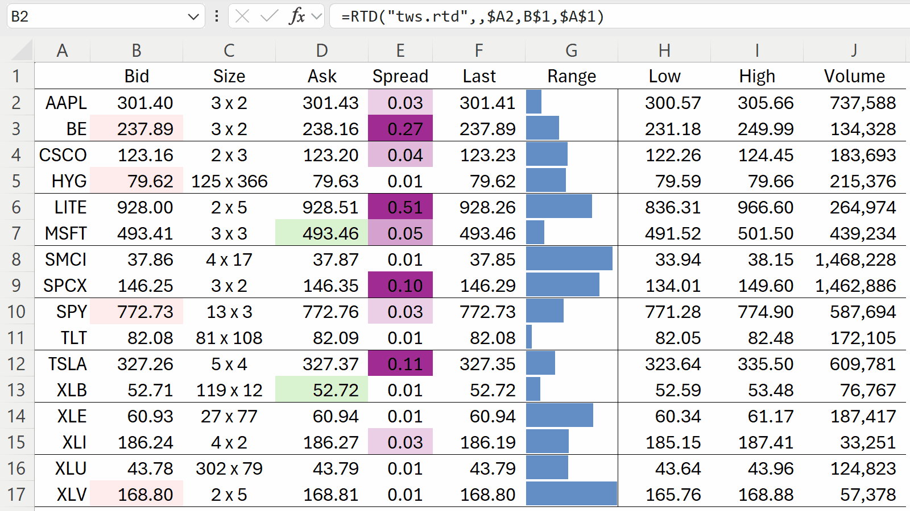

# StreamXLS

**Stream Interactive Brokers data into Excel with native `=RTD()` formulas.**
Market data, account values, orders, positions with live P&L — StreamXLS is a production-grade component that makes it easy to bring realtime Interactive Brokers data into Excel.

*StreamXLS is closed-source commercial software; this repository hosts its signed installer releases, documentation, discussions, and issue tracker — [more below](#what-this-repository-is).*

## Documentation

**[StreamXLS.com/docs](https://streamxls.com/docs)** hosts basic documentation and is the recommended starting point for new users. This repository holds the [complete documentation](docs/README.md):

- [quickstart.md](docs/quickstart.md) — start here: your first `=RTD()` formulas across status, account, market-data, positions, and orders.
- [manual.md](docs/manual.md) — complete explanations of how to get what you want via StreamXLS.
- [reference.md](docs/reference.md) — the comprehensive reference: every topic, every field, every setting.

## Downloads

- **[Releases](https://github.com/StreamXLS/streamxls/releases)** — signed, per-user installer (no admin rights required). Each installer's SHA-256 is published with the release and at [streamxls.com/download](https://streamxls.com/download), which also explains how to verify the installer is safe.  (Windows SmartScreen may still issue warnings until the StreamXLS install base reaches [Microsoft's "reputation" threshold](https://learn.microsoft.com/en-us/windows/apps/package-and-deploy/smartscreen-reputation).)
  - StreamXLS offers a 30-day, full-featured trial: it starts automatically the first time StreamXLS is used in Excel.
  - Subscriptions start at $59/month — current pricing at [streamxls.com/buy](https://streamxls.com/buy).
- **[Demo workbook](examples/StreamXLS.xlsm)** — every feature illustrated in one workbook, so you can start without reading further.  A local copy ships with the installer and can be opened from the StreamXLS Control Panel (click **Open the demo workbook**).  You can also download it [here](./examples/StreamXLS.xlsm) or from [streamxls.com](https://streamxls.com/StreamXLS.xlsm).  The embedded code is signed, but Excel blocks downloaded copies from running VBA until you unblock the file: Right click → Properties → **Unblock**.

## What this repository is

StreamXLS is closed-source commercial software.  This repository maintains the signed releases, documentation, and feedback.

- Questions and how-tos: [GitHub Discussions](https://github.com/StreamXLS/streamxls/discussions) — answers stay public and searchable, so the next person with the same question finds them.
- Bug reports and feature requests: [GitHub Issues](https://github.com/StreamXLS/streamxls/issues). Account or license issues: email support instead — those usually involve details that shouldn't be public.
- Commercial inquiries (source license, integration partnership, OEM redistribution) and pre-sales questions: [sales@streamxls.com](mailto:sales@streamxls.com).
- Customer support: [support@streamxls.com](mailto:support@streamxls.com) — we aim to respond within one US business day.

StreamXLS is actively developed and commercially supported; the current release is always available on the [Releases](https://github.com/StreamXLS/streamxls/releases) page. Releases publish here and reach installed copies through the product's update channel (updates are offered, never forced — nothing installs without your action); release notes call out changes, including any change to the topic-string schema.

Repository contents are © 2026 StreamXLS LLC, all rights reserved (see [LICENSE](LICENSE)); the software product ships under its own [End-User License Agreement](https://streamxls.com/eula).

---

*StreamXLS is not affiliated with, endorsed by, or sponsored by Interactive Brokers. Trader Workstation, the TWS API, and Excel are products of their respective owners; their use is governed by their respective licenses. StreamXLS does not provide investment advice or recommendations.*
