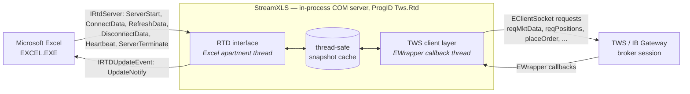

# Architecture Overview

This document gives a high-level view of how StreamXLS works.

## Component layout

- **Excel** owns every call into the RTD server. `IRtdServer` has exactly six methods, all of them invoked by Excel: `ServerStart()` when Excel first instantiates the server (this is where Excel hands over its `IRTDUpdateEvent` callback object), `ConnectData()` when a worksheet introduces a new `=RTD(...)` topic, `RefreshData()` on the throttle interval, `DisconnectData()` when the last cell formula referencing a topic is removed, `Heartbeat()` to confirm the server is still alive after a quiet period, and `ServerTerminate()` on shutdown. The single call in the other direction is `IRTDUpdateEvent.UpdateNotify()` — StreamXLS telling Excel that a `RefreshData()` pass has something to collect.
- **StreamXLS** is a COM component registered with the ProgID `Tws.Rtd`. It receives RTD calls on Excel's COM apartment thread, maps topics to TWS subscriptions, and pushes value updates back into the cached snapshot that Excel reads on the next `RefreshData()` pass.
- **TWS / IB Gateway** is the upstream — the IBKR client process that holds the broker session. StreamXLS is a TWS API client of the same kind as `ib_async`, the official `EClientSocket` samples, or a custom C++ client; it just speaks Excel's RTD protocol on the other side.

## Per-Excel-process connection model

Each `EXCEL.EXE` process that loads StreamXLS establishes its own TWS API client connection. This is the standard Excel + COM behaviour — every instance of Excel loads its own copy of the in-process COM server — and StreamXLS leans into it rather than fighting it.

Consequence: running two Excel instances, both requesting data from a TWS session, creates two independent StreamXLS instances, each with its own TWS client connection. They do not contend for a shared subscription map.

### clientId allocation

TWS accepts one connection per client ID. Two Excel instances therefore need two distinct client IDs. By default, StreamXLS picks a per-process client ID automatically to reduce collisions across instances and with concurrent `ib_async` or sample-code sessions. To pin a specific client ID (for example, to satisfy a TWS configuration that requires `clientId=0` for certain features), set the `TWS_RTD_CLIENT_ID` environment variable before launching Excel.

Order monitoring is **poll-based regardless of client ID**: whenever order topics are active, StreamXLS refreshes the order snapshot at a configurable interval (default 15 seconds, via `TWS_RTD_ORDER_REFRESH_SECONDS`). Order-status cells can therefore lag a fill or cancel by up to one polling interval; pinning a particular client ID (including `0`) does not change the refresh mechanism.

## Subscription deduplication within a process

Inside a single Excel process, however, the picture is reversed. Many cells in the same workbook (or across multiple workbooks open in the same instance) can reference the same logical topic — for example, a top-of-book quote for `SPY` shown in 30 different cells.

StreamXLS deduplicates: one subscribed topic per unique topic string per process, regardless of how many `=RTD()` cells reference it. The deduplication is visible to the user as `ActiveTopicCount` on the Status tab — that count tracks distinct subscribed topics, not Excel cell references (the engine may consolidate or fan out the underlying TWS API requests further).

This is what lets a workbook with hundreds of `=RTD()` formulas run on a single API client without saturating pacing limits.

## UI-priority tolerance

Microsoft Excel gives its UI thread priority over RTD updates. IBKR's own Excel RTD documentation describes this clearly:

> [B]y design, Microsoft Excel gives precedence to the UI. Updates are ignored when a modal dialog is displayed, a cell is being edited, or Excel is busy. ([IBKR Campus, Excel RTD page](https://www.interactivebrokers.com/campus/ibkr-api-page/excel-rtd/))

A naive RTD implementation drops the data delivered during those periods. StreamXLS maintains its internal cache independently of Excel's polling, so a modal dialog open over a streaming chain does not cause data loss — when Excel returns to a ready state, it reads the latest cached value rather than a stale or null one. The [demo video](https://vimeo.com/1191256765) shows this behaviour explicitly (a modal Format Cells dialog opened over a streaming options chain).

## Topic schema

StreamXLS exposes six topic families. The exact topic-string grammar — every family, contract-specification syntax, and field — is documented at [streamxls.com/docs-reference](https://streamxls.com/docs-reference). The families are:

| Family | Topic-string shape | Examples |
|---|---|---|
| **Status** | `status, <field>` | `IsConnected`, `ActiveTopicCount`, `LastUpdateUtc`, `ServerHeartbeatUtc`, `PositionDataState`, `OrderDataState`, `AccountsCSV` |
| **Market Data** | `<contract>, <field>` | top-of-book quotes (bid / ask / last / size / volatility / Greeks), option-chain enumeration (expirations / strikes / strike step); derived fields `MarketPrice`, `LastOrClose` |
| **Accounts** | `account, <AccountNumber>, <field>[, <currency>]` | the full TWS-delivered account value set (~136 keys on a typical margin account; the set varies by account type) including NLV, buying power, currency balances, margin, plus computed fields like OpenPositionCount |
| **Positions** | `position, <Accounts>, <contract>, <field>` and `positions, <Accounts>, <ListField>` | per-account, per-contract position size, average cost, market value, realised / unrealised P&L; positions-list topics return `SymbolsCsv` / `ConIdCsv` / `PositionsChangedUtc` |
| **Order monitoring** | `orders, <Accounts>, <ListField>` and `order, <permId>, <field>` | list topics return `ListCsv` (all orders, including filled/cancelled) or `OpenListCsv` (open only) as permId lists; per-order topics address an order by its **permId** (from the list topics — not the small per-client order id TWS displays) and return [roughly 80 read fields, a closed set](reference.md#5-order-read-fields) including `Status`, `Filled`, `Remaining`, `LmtPrice`, `AvgFillPrice`, `Side`, `OrderType`, `TIF` |
| **Order staging** | `StageOrder, <key>=<value>, ...` | stages an order as the side-effect of subscribing; topic returns a status string (`Sending` → `Staged`, or `SendOrder Error: <message>`) |

Every family is queried through the same `=RTD()` worksheet function. There is no separate add-in, no VBA glue, no ActiveX object on the worksheet — only native RTD formulas.

## Thread model

Excel calls the RTD interface on its single-threaded apartment: all six `IRtdServer` callbacks arrive on Excel's thread, and the server's `UpdateNotify` signal marshals back to it. On the TWS side, a dedicated EWrapper-callback thread receives API messages. A thread-safe internal cache sits between the two; pacing and reconnection logic live in the upstream-facing layer, and Excel only ever sees the cache.

## What this does not do

- **Replace TWS.** StreamXLS connects to a running TWS or IB Gateway; it does not implement the broker session itself.
- **Run without TWS API socket permissions.** Standard IBKR account API enablement applies (Configure → API → Settings → Enable ActiveX and Socket Clients, plus trusted-IP setup).
