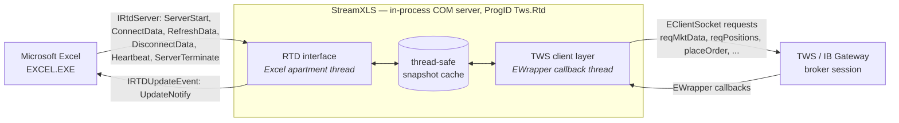
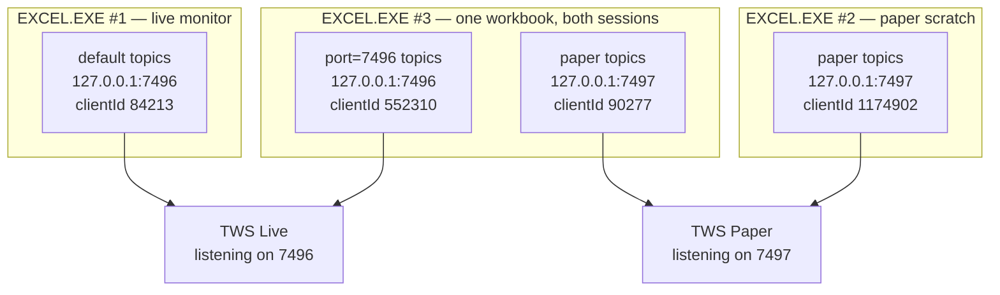
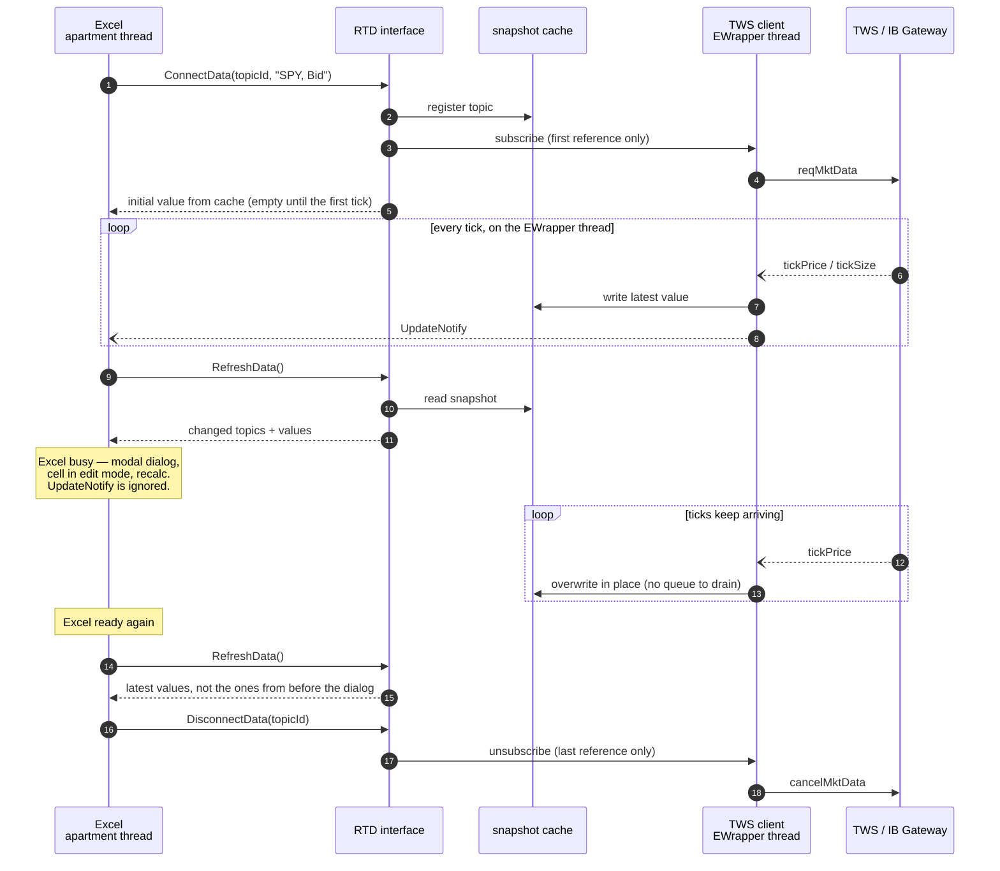

# Architecture Overview

This document gives a high-level view of how StreamXLS works with Excel and TWS.

## Component layout

- **Excel** owns every call into the RTD server. `IRtdServer` has exactly six methods, all of them invoked by Excel: `ServerStart()` when Excel first instantiates the server (this is where Excel hands over its `IRTDUpdateEvent` callback object), `ConnectData()` when a worksheet introduces a new `=RTD(...)` topic, `RefreshData()` on the throttle interval, `DisconnectData()` when the last cell formula referencing a topic is removed, `Heartbeat()` to confirm the server is still alive after a quiet period, and `ServerTerminate()` on shutdown. The single call in the other direction is `IRTDUpdateEvent.UpdateNotify()` — StreamXLS telling Excel that a `RefreshData()` pass has something to collect.
- **StreamXLS** is a COM component registered with the ProgID `Tws.Rtd`. It receives RTD calls on Excel's COM apartment thread, maps topics to TWS subscriptions, and pushes value updates back into the cached snapshot that Excel reads on the next `RefreshData()` pass.
- **TWS / IB Gateway** is the upstream — the IBKR client process that holds the broker session. StreamXLS is a TWS API client of the same kind as `ib_async`, the official `EClientSocket` samples, or a custom C++ client; it just speaks Excel's RTD protocol on the other side.

## Connection model

Each `EXCEL.EXE` process that loads StreamXLS gets its own instance of the COM server. This is the standard Excel + COM behaviour — every instance of Excel loads its own copy of an in-process server — and StreamXLS leans into it rather than fighting it.

Within one instance, a connection is identified by the triple `host:port:clientId`, and every distinct triple that appears in that process's topic strings gets its own TWS API socket. The endpoint is chosen per formula (ref. [connection parameters](manual.md#connection-parameters)), so a single workbook can receive data from simultaneously from more than one TWS or IB Gateway session.

Three Excel processes against two TWS sessions on one machine — the general case, with process #3 reading from both:

Nothing crosses a process boundary: the four connections above carry four independent subscription maps, and two Excel instances watching the same symbol on the same TWS subscribe to it twice. The only shared resource is TWS itself, along with its market-data lines and pacing limits.

### Client ID allocation

TWS accepts one connection per client ID per session. StreamXLS therefore draws a **random client ID for each connection**, in the range 70,000 to ~2.14 billion — high enough to be unmistakable against a port number, and wide enough that a collision with another Excel instance or a concurrent `ib_async` or sample-code session is a remote possibility rather than something to plan around. Auto IDs are not stable across Excel restarts.

To pin one instead — to reserve a "master" API client slot, to satisfy a TWS configuration that wants a particular ID, or to reconcile against an order feed — pass `clientid=` in the topic strings, or set the **TWS client ID** setting (environment variable `TWS_RTD_CLIENT_ID`) to supply the ID for every connection that does not name one. A formula wins over the setting. Pinning two connections to the *same* explicit ID on the *same* TWS session does collide: TWS rejects the second with error 326, and StreamXLS retries.

Order monitoring is **poll-based regardless of client ID**: whenever order topics are active, StreamXLS refreshes the order snapshot at a configurable interval (default 15 seconds, via `TWS_RTD_ORDER_REFRESH_SECONDS`). Order-status cells can therefore lag a fill or cancel by up to one polling interval; pinning a particular client ID (including `0`) does not change the refresh mechanism.

## Subscription deduplication

Inside a single Excel process, however, the picture is reversed. Many cells in the same workbook (or across multiple workbooks open in the same instance) can reference the same logical topic — for example, a top-of-book quote for `SPY` shown in 30 different cells.

StreamXLS deduplicates: one subscribed topic per unique topic per process, regardless of how many `=RTD()` formulas reference it. The deduplication is visible to the user as `ActiveTopicCount`, which totals distinct subscribed topics, not the number of RTD formulas.

This is what lets a workbook with hundreds of `=RTD()` formulas run on a single API client without saturating pacing limits.

## UI-priority tolerance

Microsoft Excel gives its UI thread priority over RTD updates. IBKR's own Excel RTD documentation describes this clearly:

> [B]y design, Microsoft Excel gives precedence to the UI. Updates are ignored when a modal dialog is displayed, a cell is being edited, or Excel is busy. ([IBKR Campus, Excel RTD page](https://www.interactivebrokers.com/campus/ibkr-api-page/excel-rtd/))

A naive RTD implementation drops the data delivered during those periods. StreamXLS maintains its internal cache independently of Excel's polling, so a modal dialog open over a streaming chain does not cause data loss — when Excel returns to a ready state, it reads the latest cached value rather than a stale or null one. The [demo video](https://vimeo.com/1191256765) shows this behaviour explicitly (a modal Format Cells dialog opened over a streaming options chain).

## Topic schema

StreamXLS exposes six topic families. The exact topic-string grammar — every family, contract-specification syntax, and field — is documented at [streamxls.com/docs-reference](https://streamxls.com/docs-reference). The families are:

| Family | Topic-string shape | Examples |
|---|---|---|
| **Status** | `status, <field>` | `IsConnected`, `ActiveTopicCount`, `LastUpdateUtc`, `ServerHeartbeatUtc`, `PositionDataState`, `OrderDataState`, `AccountsCSV` |
| **Market Data** | `<contract>, <field>` | top-of-book quotes (bid / ask / last / size / volatility / Greeks), option-chain enumeration (expirations / strikes / strike step); derived fields `MarketPrice`, `LastOrClose` |
| **Accounts** | `account, <AccountNumber>, <field>[, <currency>]` | the full TWS-delivered account value set (~136 keys on a typical margin account; the set varies by account type) including NLV, buying power, currency balances, margin, plus computed fields like OpenPositionCount |
| **Positions** | `position, <Accounts>, <contract>, <field>` and `positions, <Accounts>, <ListField>` | per-account, per-contract position size, average cost, market value, realised / unrealised P&L; positions-list topics return `SymbolsCsv` / `ConIdCsv` / `PositionsChangedUtc` |
| **Order monitoring** | `orders, <Accounts>, <ListField>` and `order, <permId>, <field>` | list topics return `ListCsv` (all orders, including filled/cancelled) or `OpenListCsv` (open only) as permId lists; per-order topics address an order by its **permId** and return [roughly 80 read fields, a closed set](reference.md#5-order-read-fields) including `Status`, `Filled`, `Remaining`, `LmtPrice`, `AvgFillPrice`, `Side`, `OrderType`, `TIF` |
| **Order staging** | `StageOrder, <key>=<value>, ...` | stages an order as the side-effect of subscribing; topic returns a status string (`Sending` → `Staged`, or `StageOrder Error: <message>`) |

Every family is queried through the same `=RTD()` worksheet function. There is no separate add-in, no VBA glue, no ActiveX object on the worksheet — only native RTD formulas.

## Thread model

Excel calls the RTD interface on its single-threaded apartment: all six `IRtdServer` callbacks arrive on Excel's thread, and the server's `UpdateNotify` signal marshals back to it. On the TWS side, a dedicated EWrapper-callback thread receives API messages. A thread-safe internal cache sits between the two; pacing and reconnection logic live in the upstream-facing layer, and Excel only ever sees the cache.

The consequence worth tracing is what happens in the gap between the two threads.  The cache absorbs the upstream feed at its own rate, so an Excel that stops collecting for a while does not lose data (the [UI-priority tolerance](#ui-priority-tolerance) property above):

Two properties fall out of this design:

1. The cache is overwritten rather than queued, so a long busy period costs intermediate ticks but never leaves Excel holding a stale value.
2. And `subscribe` / `unsubscribe` are reference-counted at steps 3 and 17 — the mechanism behind [subscription deduplication](#subscription-deduplication).

## What this does not do

- **Replace TWS.** StreamXLS connects to a running TWS or IB Gateway, via the Interactive Brokers TWS API; it does not implement the broker session itself.
