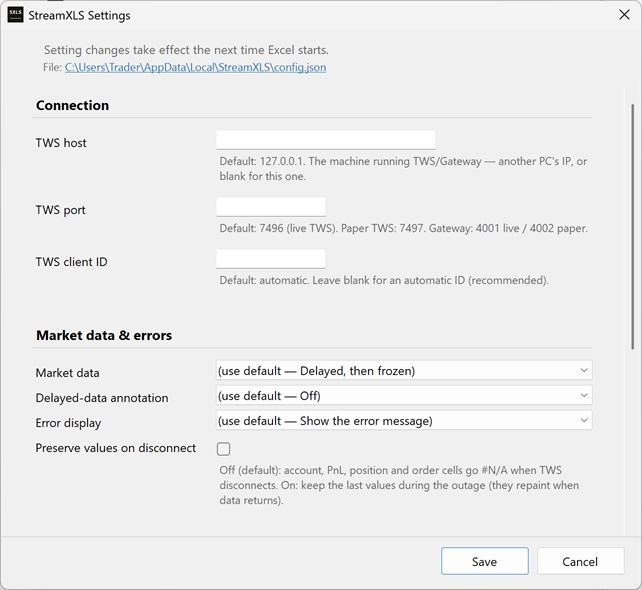
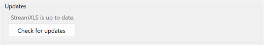
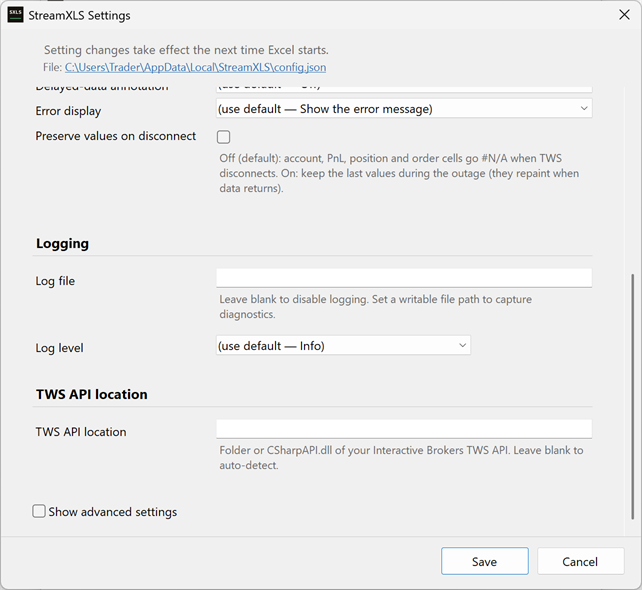
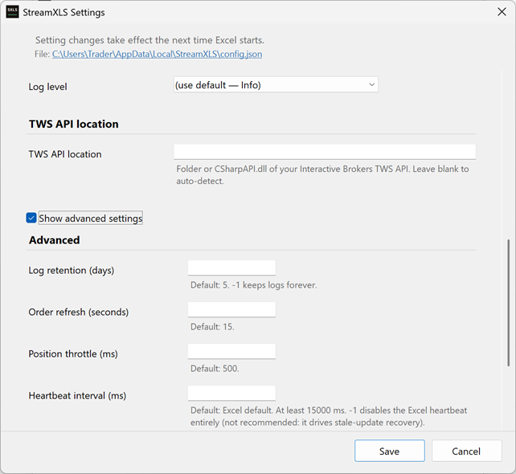

# StreamXLS manual

This is the working manual for StreamXLS `=RTD()` formulas in Excel: how to specify any contract —
stocks, options, futures, forex, combos, or a bare ConID — how to read market-data, account, position
and order topics, how to stage an order into TWS.  Also, what a formula returns when
the connection or your license changes underneath it.

[quickstart.md](quickstart.md) gets your first formulas working.
[reference.md](reference.md) tabulates the complete vocabulary — every topic, field, key, status value
and cell-error value. This document is the layer between them: the conventions and the runtime
behavior the reference only lists. Looking up one field name? Go to the reference. Working out how to
make a formula do something? Stay here.

## Contents

- [RTD formula structure](#rtd-formula-structure)
- [Contract specification methods](#contract-specification-methods)
- [Blank arguments: three rules](#blank-arguments-three-rules)
- [Specifying options](#specifying-options)
- [Specifying futures](#specifying-futures)
- [Specifying forex (CASH)](#specifying-forex-cash)
- [Specifying combos and spreads](#specifying-combos-and-spreads)
- [Market data field reference](#market-data-field-reference)
- [Position topics](#position-topics)
- [Account topics](#account-topics)
- [Order topics](#order-topics)
- [Staging orders (StageOrder)](#staging-orders-stageorder)
- [Connection status and diagnostics](#connection-status-and-diagnostics)
- [Formula states and lifecycle](#formula-states-and-lifecycle)
- [Troubleshooting common issues](#troubleshooting-common-issues)
- [Advanced: environment variables](#advanced-environment-variables)
- [Further reading](#further-reading)
- [Quick reference card](#quick-reference-card)

---

## RTD formula structure

The Excel RTD function has the following structure:

```
=RTD(ProgID, Server, Topic1, Topic2, Topic3, ...)
```

For StreamXLS:

- ProgID: `"Tws.Rtd"` — required: tells Excel to send the request to StreamXLS
- Server: Leave empty — Excel reserves this for its internal use
- Topic1, Topic2, ...: Topics and fields (parsed by StreamXLS)

### The Server argument (second parameter)

**The second "Server" argument named in Excel's RTD function is reserved for Excel's use; StreamXLS never sees it.** All connection parameters must be specified in the topic strings (third argument onward).

Correct usage:

| Formula | What it does |
|---|---|
| `=RTD("Tws.Rtd",, "AAPL", "BID")` | Default connection: `127.0.0.1:7496` |
| `=RTD("Tws.Rtd",, "host=192.168.1.100", "port=7497", "AAPL", "BID")` | A custom host and port |
| `=RTD("Tws.Rtd",, "127.0.0.1:4001", "AAPL", "BID")` | A custom host and port in compact `host:port` form |

Incorrect usage — connection parameters in the server argument are ignored:

| Formula | Why it fails |
|---|---|
| `=RTD("Tws.Rtd", "port=7496", "status", "IsConnected")` | `port=7496` sits in the server argument and is ignored |
| `=RTD("Tws.Rtd", "127.0.0.1:7497", "AAPL", "BID")` | the whole connection string is in the server argument and is ignored |

### Connection parameters

Connection parameters can be specified anywhere in the topic strings — order doesn't matter.

The connection parameter can be a cell reference that is sometimes empty — this is the pattern used in the demo workbook's `$A$2`
"Custom connection" idiom. An empty cell simply means "no connection named," so the formula falls back
to the default connection. **Put such a reference at the *end* of the argument list:**

```excel
=RTD("Tws.Rtd",, "AAPL", "Last", $A$2)                              ' market data
=RTD("Tws.Rtd",, "position", $A$3, "conid="&$A6, "Position", $A$2)  ' position: $A$3 is the accounts cell
```

**Why the end, and not the front.** On `position`, `positions`, and `orders`, the first argument slot is
the `{Accounts}` filter, which is itself allowed to be blank (blank = all accounts). In that case, a blank connection value
placed ahead of the contract on those topics is interpreted as an account filter. Trailing is unambiguous on every
topic, which is why the demo workbook writes it that way.

| Parameter | Format | Description | Default |
|-----------|--------|-------------|---------|
| Host | `host={ip-or-hostname}` | TWS or IB Gateway IP address or hostname | `127.0.0.1` |
| Port | `port={port-number}` | TWS or IB Gateway socket port | `7496` |
| Client ID | `clientid={number}` | API client ID (0-2147483646) | Auto-generated |

Alternative port aliases:

| Alias | Port | Description |
|-------|------|-------------|
| `paper` | 7497 | TWS paper trading |
| `gw` | 4001 | IB Gateway live |
| `gwpaper` | 4002 | IB Gateway paper |

### Connection string formats

Key-value format:

```excel
=RTD("Tws.Rtd",, "host=192.168.1.100", "port=4001", "clientid=5", "AAPL", "BID")
```

Compact format (`host:port` or `host:port:clientid`):

```excel
=RTD("Tws.Rtd",, "192.168.1.100:4001", "AAPL", "BID")
=RTD("Tws.Rtd",, "192.168.1.100:4001:5", "AAPL", "BID")
```

The compact format separates with colons, not underscores — `127.0.0.1:7497:12345` parses;
`127.0.0.1_7497_12345` does not.

Port alias format:

| Formula | Connects to |
|---|---|
| `=RTD("Tws.Rtd",, "paper", "AAPL", "BID")` | `127.0.0.1:7497` |
| `=RTD("Tws.Rtd",, "gw", "AAPL", "BID")` | `127.0.0.1:4001` |
| `=RTD("Tws.Rtd",, "gwpaper", "AAPL", "BID")` | `127.0.0.1:4002` |

### Multiple connections

You can connect to multiple TWS or IB Gateway instances simultaneously. Each unique `host:port:clientid` combination creates a separate connection:

| Formula | Connects to |
|---|---|
| `=RTD("Tws.Rtd",, "port=7496", "AAPL", "BID")` | Live TWS |
| `=RTD("Tws.Rtd",, "port=7497", "AAPL", "BID")` | Paper TWS |
| `=RTD("Tws.Rtd",, "port=4001", "AAPL", "BID")` | IB Gateway live |

Each RTD subscription can use different connection parameters.

### Client ID

Every API connection to TWS identifies itself with a client ID. Pass `clientid=` in a formula to
choose one; otherwise StreamXLS picks a random client ID for each connection, in the range
70,000 to ~2.14 billion — kept above 70,000 so it is easy to tell apart from a port number.

- A formula wins over the settings. `clientid=` in the topic strings takes precedence over the
  **TWS client ID** setting (**StreamXLS Control Panel → Settings → TWS client ID**). The setting supplies the ID for any connection whose formula does not name one; set it to pin one predictable ID across a workbook, and use `clientid=` where a
  particular cell needs its own client slot.
- An auto ID is not stable across Excel restarts. A fresh random ID is drawn each session. If
  you need a fixed one — to reserve a "master" API client slot in TWS, or to reconcile against an
  order feed — set **TWS client ID** or pass `clientid=`.
- Two auto-ID instances are very unlikely to collide — with a ~2.14-billion range, two sessions
  drawing the same number is a remote possibility rather than something to plan around. Pinning two
  instances to the *same* client ID will fail: TWS rejects the second connection with error
  326 (client ID already in use).
- A pinned ID is not rotated for you — it reflects your stated intent. An auto ID may draw a
  fresh random value after a connection failure, including a single pre-handshake drop (TWS closing
  the socket before the handshake completes), which is a signature of TWS rate-limiting that ID.
  (Rotation is rate-capped so it cannot thrash.)

### Settings and configuration keys

Some behavior is set outside your formulas — the default connection, the market-data tier, logging,
and the disconnect policy among them. **StreamXLS Control Panel → Settings** is the normal way to
change any of it: the dialog edits each setting with its valid range and default in view and writes
them to your config file (`%LOCALAPPDATA%\StreamXLS\config.json`), and the changes take effect the
next time Excel starts the engine. Every setting also has an environment-variable form — the
override route for scripted or per-machine setups.



`=RTD("Tws.Rtd",, "status", "ConfigWarnings")` reports any setting the engine could not use and is empty when your configuration is clean. The complete list — every setting, its Control Panel label, its environment variable, and its default, plus the rules that decide which route wins
— is in [Advanced: environment variables](#advanced-environment-variables).

---

## Contract specification methods

StreamXLS supports multiple syntaxes for specifying contracts.

### Method 1: simple symbol (stocks only)

For U.S. equities, just use the ticker:

```excel
=RTD("Tws.Rtd",, "AAPL", "BID")
=RTD("Tws.Rtd",, "IBM", "LAST")
=RTD("Tws.Rtd",, "MSFT", "MarketPrice")
```

This applies the following defaults: `SecType=STK`, `Exchange=SMART`, `Currency=USD`.

**There is no "positional arguments" form.** A formula like
`=RTD("Tws.Rtd",, "AAPL", "STK", "NASDAQ", "USD", "LAST")` does not set SecType, Exchange, or
Currency by position. Only the first bare argument is read as the symbol and `LAST` resolves as the
field; the arguments between them are discarded, with no error, because the formula still resolves — so that cell quotes AAPL on
`SMART` in `USD` and your `NASDAQ` qualifier is simply gone. Contract qualifiers beyond the symbol
must use `key=value` (Method 2) or compact notation (Method 3).

### Method 2: key-value pairs (recommended for complex securities)

Use `key=value` syntax for explicit, self-documenting formulas:

```excel
=RTD("Tws.Rtd",, "sym=SPY", "sec=OPT", "strike=680", "right=C", "exp=20261218", "BID")
=RTD("Tws.Rtd",, "sym=ES", "sec=FUT", "exch=CME", "exp=202612", "LAST")
```

Common keys (case-insensitive) — the complete set of contract keys, with every alias and the symbol-only defaults, is in [reference.md §3](reference.md#3-contract-specification-keys). The *values* are case-insensitive too: `sym=spy` and `sym=SPY` ask for the same contract and share one subscription, as on every other notation. The two exceptions are `loc` and `tc`, which TWS reads case-sensitively and which StreamXLS therefore passes through exactly as typed:

| Key | Aliases | Description |
|-----|---------|-------------|
| `sym` | `symbol` | Underlying symbol |
| `sec` | `sectype`, `securitytype` | Security type (`STK`, `OPT`, `FUT`, `FOP`, `CASH`, `IND`, …) |
| `exch` | `exchange` | Routing exchange (`SMART` for the universal router). Routing a US *stock or warrant* to a venue directly needs an entitlement — see [Exchange-direct routing for US stocks](#exchange-direct-routing-for-us-stocks) |
| `prim` | `primary`, `primexch`, `primaryexch`, `primaryexchange` | Primary listing exchange — disambiguates SMART-routed symbols |
| `cur` | `curr`, `currency` | Currency (`USD`, `EUR`, `GBP`, …) |
| `exp` | `expiry`, `expiration`, `lasttradedate` | Expiration — `YYYYMMDD` for options (`20261218`), or the contract month `YYYYMM` for futures (`202612`) |
| `strike` | `strikeprice` | Option strike price |
| `right` | `putcall`, `optiontype` | Option right: `C` (call) or `P` (put) |
| `mult` | `multiplier` | Contract multiplier |
| `loc` | `local`, `localsymbol` | Exchange-specific local symbol |
| `tc` | `class`, `tradingclass` | Trading class — identifies a contract; it does not filter an option chain, see [Enumerating an option chain](#enumerating-an-option-chain) |
| `conid` | `contractid` | TWS contract ID (authoritative when present) |

#### One key per argument, or every key in one argument

The keys above can be written as separate RTD arguments, as in the examples, or joined into a *single*
argument with semicolons — `"sym=SPY;sec=OPT;strike=680;right=C;exp=20261218"`. On a quote, an
option-definition or a `StageOrder` formula the two forms parse identically; use whichever suits the
sheet.

The `position` topic accepts **only** the joined form. It reads one argument as the contract and the
next as the field, so a second `key=value` argument lands in the field slot and fails loud
(`Unsupported position field sec=OPT.`). The compact notations below are single arguments by nature,
so they work there unchanged.

A few `StageOrder` keys are an exception to the joined form, for two different reasons. `tag` (and
its synonyms `nonce`, `seq`, `submit`, `clienttag`), `account`, `fagroup` and `ocagroup` are free
text, so each keeps everything after its `=` and a `;` there is data rather than a separator:
`"tag=A;B"` is a tag reading `A;B`. `algoparams` is judged whole by its own grammar, which rejects a
`;` outright (see [Optional parameters (common)](#optional-parameters-common)). Write each of them as
its own argument. Joined *behind* another key (`"sym=SPY;tag=A"`), or carrying a recognized key
inside its own value (`"tag=ORD17;exch=CBOT"` could mean a tag plus a venue, or a tag whose text
contains one), the argument fails loud rather than guessing where the value ends.

A connection reference (`paper`, `gw`, `gwpaper`, `host=`, `port=`, `clientid=`, `host:port`) must be
its own argument too, for a different reason again: it is read from the *whole* argument, so joined
with a `;` it would be invisible to the connection and the order would stage on the default TWS. It
fails loud instead.

### Method 3a: compact `/` notation

Use `@` for exchange and `/` as delimiter:

```excel
=RTD("Tws.Rtd",, "AAPL@SMART/NASDAQ/STK/USD", "BID")
=RTD("Tws.Rtd",, "ES@CME/FUT/202612/USD", "LAST")
=RTD("Tws.Rtd",, "SPY@SMART/OPT/20261218/C/680/USD", "BID")
```

Format: `SYMBOL@EXCH[/PRIMEXCH]/SECTYPE[/EXP][/RIGHT][/STRIKE][/CURRENCY]`

The first example routes through `SMART` and names `NASDAQ` as the *primary* (listing) exchange —
which is how you tell StreamXLS which AAPL you mean without asking TWS to trade on NASDAQ directly.
Routing a US stock directly to a venue is a different request with a consequence attached; see
[Exchange-direct routing for US stocks](#exchange-direct-routing-for-us-stocks) below before you
write one.

After the security type, segments are read by shape, not by position — StreamXLS recognizes an
expiry, a right, a strike, and a currency by their form, so you can omit any of them, including ones
in the middle. `AAPL@SMART/STK/USD` omits the primary exchange and the option segments;
`ES@CME/FUT/202612/USD` omits the right and strike. Add a primary exchange as an extra segment right
after the exchange when you need one, as the first example does.

One rule: the security type itself is positional — the first segment after the exchange (or
after the primary exchange, if you gave one) is *always* read as the security type, and StreamXLS
treats a segment as a primary exchange only when a security type follows it. So if you specify a
primary exchange, a security type must immediately follow it: `AAPL@SMART/NASDAQ/STK` works, while
`AAPL@SMART/NASDAQ` and `AAPL@SMART/NASDAQ/USD` put `NASDAQ` and `USD` where the security type goes
and are refused with a message that names the segment, the accepted types and the spelling to use
(`AAPL@SMART/NASDAQ/STK`, `AAPL@SMART/NASDAQ/STK/USD`) rather than being sent to TWS as a contract
that cannot resolve. Spell the security type exactly (`STK`, `OPT`, `FUT`, `FOP`, `CASH`, `IND`,
`BOND`, `CFD`, `CRYPTO`, `FUND`, `CMDTY`, `WAR`, and the other TWS security types). If a compact
string does not resolve the contract you expect, use the unambiguous `key=value` form.

Omitting a segment is fine; writing one and leaving it *empty* is not. `BHP@ASX/STK` omits the
currency and works; `"BHP@ASX/STK/"&B2` with `B2` blank writes a currency segment with nothing in it
and fails loud, because it would otherwise quote the `USD` line instead of the `AUD` one. The same
holds for `"BHP@"&B2` and for `"EUR."&B2&"/CASH"`. Build the optional part with `IF` —
`"BHP@ASX/STK"&IF(B2="","","/"&B2)`. (The pipe form below is the exception: its segments are
positional, so an empty segment is how you omit one.)

FX pairs get their own shorthand — `BASE.QUOTE/CASH`:

```excel
=RTD("Tws.Rtd",, "EUR.USD/CASH", "BID")
```

The `positions` topic hands these compact identifiers back to you: its `SymbolsCsv` field returns your whole
portfolio with contracts specified in compact notation. See [The positions list](#the-positions-list).

### Method 3b: compact `|` notation

A pipe form is the second compact shorthand — five positional segments, no `@` —
`SYMBOL|SECTYPE|EXPIRY|RIGHT|STRIKE`:

```excel
=RTD("Tws.Rtd",, "SPY|OPT|20261218|C|680", "BID")
=RTD("Tws.Rtd",, "ES|FUT|202612", "exch=CME", "LAST")
```

The first is the December 2026 SPY 680 call, the second the December 2026 E-mini. Pipe segments are
read strictly by position, not by shape as the `/` segments are — a segment you do not need must be
left empty rather than dropped, or everything after it shifts into the wrong slot. `SPY||||` still
resolves to the plain stock. This is the one place where an empty field is legal: because position
carries the meaning here, an empty segment *is* how you say "not this one" — so
`"SPY|OPT|20261218|C|"&B2` with a blank `B2` asks for an option with no strike, and StreamXLS sends
that contract as written for TWS to answer.

Two positions are still required. The symbol, and — whenever a *later* segment is filled in — the
security type: an empty security-type segment is read as `STK`, so `"ES|"&B2&"|202612"` with a blank
`B2` would ask for a *stock* named ES carrying a futures expiry. Rather than rely on TWS to reject
that (a stock quote for `CL||202612` is Colgate-Palmolive, not crude oil), StreamXLS fails the cell
loud. `SPY||||` and `SPY|` write no later segment and stay legal.

There are no exchange or currency segments, so both take the Method 1
defaults; add `exch=` or `cur=` as separate arguments where those defaults are wrong, as the futures
example does — a *sixth* pipe segment is not a place to put them, and fails loud rather than being
dropped. A `key=value` argument beats the pipe segment for the same field, so you can override
one part without rewriting the string. The symbol is the exception: `"SPY|OPT|20261218|C|680"` next
to `"sym=IBM"` names two different instruments rather than overriding a detail of one, so it fails
loud instead of picking a winner.

Case does not matter. Like the `@` and `/` forms, the pipe form upper-cases its segments for you, so
`spy|opt|20261218|c|680` and `SPY|OPT|20261218|C|680` ask for the same contract.

### Method 4: ConID (most precise)

A TWS Contract ID identifies exactly one contract — no exchange, currency, or expiry guessing.

```excel
=RTD("Tws.Rtd",, "conid=756733", "BID")
=RTD("Tws.Rtd",, "conid=265598", "BID")
```

Those are SPY and AAPL. Verify any ConID in TWS before you paste it into a live sheet — see below.

#### When to use a ConID

- Options — many contracts share a symbol, strike, and expiry week; a ConID picks out exactly one.
- Weekly against monthly expiries — same strike, same week, different contract.
- Mini and micro contracts — easy to confuse by symbol alone.
- Generated formulas — one opaque token, so a ConID removes parsing ambiguity from a formula your system builds.
- Whenever TWS already gave you one — if you have the ConID in hand, use it.

#### Finding a ConID

- In TWS — right-click the contract row, select **Financial Instrument Info → Description**, and read
  the "ConId" field.
- From a position you hold — read the `ConID` metadata field on the `position` topic, or
  `ConIdCsv` on the `positions` topic. The contract is a single argument: semicolon-joined `key=value`,
  or compact notation.

  ```excel
  =RTD("Tws.Rtd",, "position", "U1234567", "sym=SPY;sec=OPT;strike=680;right=C;exp=20261218", "ConID")
  ```

- Programmatically — the TWS API `reqContractDetails` call.

### Exchange-direct routing for US stocks

Naming an exchange sends the request to that venue directly. For most contracts that is exactly what
you want — futures and FX have no `SMART` route at all, which is why `ES@CME` and `EUR.USD/CASH` are
written the way they are. **For US stocks it is different, and StreamXLS refuses it by default.**

Requesting a US stock direct from an exchange your IBKR account has no *real-time* market-data
subscription for makes TWS stop delivering that symbol's trade and volume data — last price, last
size, volume, and the day's open, high, low and close — for the rest of the TWS session. Bid and ask
keep flowing, so nothing announces it. It affects TWS's own watchlists as well as your workbook, and
it takes just one such request. **Pressing `Ctrl+Alt+F` in TWS** (Simulate Market Data Disconnect)
clears it without a restart.

So `AAPL@NASDAQ`, `AAPL@NASDAQ/STK/USD`, `"sym=AAPL", "exch=ARCA"` and `XYZ@NYSE/WAR/USD` all return
an error explaining this instead of quoting. Nothing is sent to TWS, so no session is ever damaged by
a formula you typed. The venues covered are the ones IBKR itself publishes as carrying US stocks —
the lit exchanges, and also its OTC books (`PINK`, `OTCLNKECN`, `ARCAEDGE`) and overnight
destinations (`OVERNIGHT`, `IBEOS`), which are included because a request that turns out to need an
entitlement costs you a silent session, while one refused unnecessarily costs you a message and a
setting. Warrants are covered alongside stocks for the same reason: IBKR lists them on most of those
same venues, so a warrant routed direct shares the venue, the feed and the entitlement with a stock
routed direct.

A `conid=` or `loc=` says which contract you mean without saying what kind it is, so it is treated by
the venue it names. On a venue that carries only stocks (`NASDAQ`, `NYSE`, `ARCA`, `IEX`, …) it is
refused like the spellings above. On the eight that also carry options — `AMEX`, `BATS`, `CBOE`,
`EDGX`, `ISE`, `MEMX`, `PEARL`, `PHLX` — it is far likelier to be an option, which cannot cause any
of this, so it goes out as written; add `"sectype=STK"` beside it if you want a stock request refused
there too.

What to write instead:

- **`AAPL`, or `AAPL@SMART`** — SMART routing, the normal way to quote a US stock.
- **`AAPL@SMART/NASDAQ/STK/USD`** — when you were naming NASDAQ to say *which* AAPL, not to route
  there. The second segment is the primary (listing) exchange, and it disambiguates without
  routing. It has to be the exchange the symbol is *listed* on: `AAPL@SMART/ARCA/STK/USD` is
  rejected by TWS, because AAPL lists on NASDAQ. Venues that route orders without listing anything
  — `NYSEFLOOR`, `OVERNIGHT`, `IBEOS`, `OTCLNKECN`, `ARCAEDGE`, and the pure execution venues —
  cannot go in that slot at all; use plain `AAPL`.
- **`SPX@CBOE/IND`** — if the contract was never a stock. A formula that names no security type is
  read as a stock, so `SPX@CBOE` is refused as one; saying `/IND` (or `/OPT`, with its expiry,
  right and strike) takes it out of scope entirely.

If you do hold an exchange's real-time subscription, name it in the `TWS_RTD_DIRECT_ROUTE_VENUES`
setting — venues separated by commas, semicolons or spaces, e.g. `CBOE` or `NASDAQ,CBOE` — and
requests to those exchanges go out as written. There is no wildcard: each venue is a separate
assertion that you hold its subscription, and an entry that is not a US stock venue opts nothing in
(it is reported in the `CONFIGWARNINGS` status field). It is settable as an environment variable or
in your config file; see [Advanced: environment variables](#advanced-environment-variables). The
setting is read when a formula is first calculated, so adding an exchange does not repaint cells that
were already refused: re-enter those formulas, or restart Excel. Every other security type, non-USD
contracts (`BHP@ASX/STK/AUD`), venues that are not US stock venues (`PHT.ESC@VALUE`), and `SMART` are
all unaffected and need no setting.

## Blank arguments: three rules

A spreadsheet is built from cells that are sometimes empty, and an empty cell inside a formula is the
one thing StreamXLS will not interpret for you — it stops with an error rather than guess. Three rules
keep every formula safe, on every topic and in every notation on this page:

1. **Name the field you want, in every formula** — `"BID"`, `"LAST"`, `"MarketValue"`.
2. **Never leave a *key* with no *value* after its `=`.** When part of the contract comes from a cell that
   may be empty, write that part as `key=value` and wrap it in `IF` so the whole argument disappears:
   `IF(B2="","","cur="&B2)`.
3. **Write the connection argument *last***, if you use one at all.

A row template that follows all three — field name in the column header `D$1`, connection in `$A$1`,
optional security type and expiry in `$B2` and `$C2`, safe to fill down whether or not those are filled:

```excel
=RTD("Tws.Rtd",, "sym="&$A2, IF($B2="","","sec="&$B2), IF($C2="","","exp="&$C2), D$1, $A$1)
```

The rest of this section is what each rule prevents. Skip it unless a formula has surprised you.

**Why rule 1.** Naming the field is the only accepted form. A field argument you supplied and left
*blank* and a field you left out both stop with an error: rather than guess — and stream a live,
plausible number under a header that says something else — StreamXLS refuses either way. The blank
draws the more specific message, since it can at least point at the blank argument, even though
StreamXLS cannot tell a cleared field-header cell from an optional key that collapsed to nothing.
Naming the field avoids both.

**Why rule 2.** `"cur="&B2` with `B2` empty produces `cur=` — a key that names part of the contract
and then fails to supply it. StreamXLS will not quietly substitute `USD`, and will not quietly drop
the key: an omitted currency and an empty one describe different instruments. The same holds for an
empty piece of the compact notation (`"BHP@ASX/STK/"&B2`, `"BHP@"&B2`, `"EUR."&B2&"/CASH"`) and for
the four extension arguments (`cmb=`, `und=`, `opt=`, `genticks=`) in
[reference.md §3](reference.md#3-contract-specification-keys). Rule 2 says to use `key=value` for
anything drawn from a cell because `IF` can drop a whole `key=value` argument cleanly, while nothing
can drop the stray `/` out of `"BHP@ASX/STK/"&B2`.

**Why rule 3.** On `position` and `positions` the *first* argument is the account filter, and a blank
there means "all accounts" — so a blank connection cell written ahead of the contract takes that slot
for itself. If your accounts cell then holds an account number, that number slides into the contract
slot and the formula fails. Written last, a connection reference is unambiguous on every topic.

Two arguments carry a meaning when left blank, and they are the only ones an empty cell should land in:

| Blank-able argument | Where it sits | What blank means |
|---|---|---|
| `{Accounts}` | first argument on `position`, `positions`, `orders` | all accounts (same as `*`) |
| connection reference | anywhere, follow rule 3 and put it *last* | use the default connection |

**Two places a blank is read differently.** You need neither to write a working formula; they are here
to explain an error you did, or did not, get. The **pipe form**'s segments are positional, so an empty
one is how that notation spells "omitted" (`SPY||||` is the plain stock) — but its symbol position is
still required, and so is its security-type position whenever a later segment is filled in (see
[Method 3b](#method-3b-compact--notation)). And `StageOrder`'s **order keys** (`side=`, `qty=`, `tif=`,
`park=`, …) read a blank as "not supplied"; its *contract* keys, `exch=` included, follow rule 2 like
any other. `sym=`/`symbol=` is the one crossover: StageOrder reads it on the order-key path, so a blank
one reads as "not supplied" and the order then fails for a missing symbol — unless you supplied a
`conid=`, which identifies the contract anyway.

Whatever fails, the failure arrives as error text in the cell, not as an Excel error value, so
`IFERROR`/`IFNA` will not hide it.

---

## Specifying options

Options require additional parameters: expiration, strike, and right (call/put).

### Option formula pattern

```excel
=RTD("Tws.Rtd",, "sym={UNDERLYING}", "sec=OPT", "exp={YYYYMMDD}", "strike={STRIKE}", "right={C|P}", "{FIELD}")
```

### Examples: SPY options

SPY $680 Call expiring December 18, 2026:

```excel
=RTD("Tws.Rtd",, "sym=SPY", "sec=OPT", "strike=680", "right=C", "exp=20261218", "BID")
=RTD("Tws.Rtd",, "sym=SPY", "sec=OPT", "strike=680", "right=C", "exp=20261218", "ASK")
=RTD("Tws.Rtd",, "sym=SPY", "sec=OPT", "strike=680", "right=C", "exp=20261218", "LAST")
=RTD("Tws.Rtd",, "sym=SPY", "sec=OPT", "strike=680", "right=C", "exp=20261218", "MarketPrice")
```

SPY $600 Put expiring January 15, 2027:

```excel
=RTD("Tws.Rtd",, "sym=SPY", "sec=OPT", "strike=600", "right=P", "exp=20270115", "BID")
```

### Options: additional fields

Options have special fields for Greeks and implied volatility, exposed per computation source. Field names compose as `{Source}{Measure}` where the source is `Bid`, `Ask`, `Last`, or `Model` — a bare measure name (e.g. `Delta` on its own) is not a valid field and errors loudly:

| Measure | Description |
|-------|-------------|
| `ImpliedVol` | Implied volatility |
| `Delta` | Option delta |
| `Gamma` | Option gamma |
| `Theta` | Option theta |
| `Vega` | Option vega |
| `OptPrice` | Option price from that computation source |
| `PvDividend` | Present value of dividends |
| `UndPrice` | Underlying price used in the computation |
| `TickAttrib` | Tick attributes for that computation snapshot |

Example — get SPY option Greeks:

```excel
=RTD("Tws.Rtd",, "sym=SPY", "sec=OPT", "strike=680", "right=C", "exp=20261218", "ModelDelta")
=RTD("Tws.Rtd",, "sym=SPY", "sec=OPT", "strike=680", "right=C", "exp=20261218", "BidImpliedVol")
```

### Option expiration formats

The `exp` parameter accepts YYYYMMDD format:

- `20261218` = December 18, 2026
- `20270115` = January 15, 2027
- `20270319` = March 19, 2027

Note: Monthly options typically expire the third Friday; weekly options expire each Friday. Use the exact expiration date from TWS.

> **Dates in these examples go stale.** Every contract named here was live when this page was written.
An expired contract resolves to no security definition, not to a price, so take the expiration you
actually want from the TWS contract details window rather than copying a date from this page.

### Enumerating an option chain

Three fields take an underlying contract and report what TWS lists against it — enough to drive
strike and expiry pickers from live data instead of a hand-kept list:

```excel
=RTD("Tws.Rtd",, "AAPL", "OptionExpirationsCSV")
=RTD("Tws.Rtd",, "AAPL", "OptionStrikesCSV")
=RTD("Tws.Rtd",, "AAPL", "StrikeStep")
```

Return values, for the given underlying (`AAPL` in the example above):

- `OptionExpirationsCSV` = comma-separated list of the expiration dates that have listed options for the given underlying.
- `OptionStrikesCSV` = comma-separated list of strike prices that have listed
options on at least one expiration date.
- `StrikeStep` = the smallest strike price increment seen in `OptionStrikesCSV`.

> **Each CSV field returns one comma-separated string, not a spilled range** — split it with
`TEXTSPLIT` (Excel 365) or Text to Columns if you want one value per cell. A contract with no
listed options returns `#N/A` rather than an empty string.

> **These three fields cover every trading class on the underlying, and cannot be narrowed to one.**
Weeklies come back alongside monthlies — `SPX` with `SPXW`. The `tc=` contract
key does not narrow them: TWS's chain request carries no trading class at all. Neither can the
sheet, because the returned dates and strikes carry no class marker; and `StrikeStep` is the
smallest increment anywhere in that aggregate, so it can be finer than any one class uses. Read all
three as an answer about the underlying, then name the exact contract you want on the market-data
formula that quotes it.

> **Exchange behaves differently from class.** A stock or index underlying answers across every
exchange TWS reports. A `FUT` or `FOP` underlying answers for the spec's `exch=` when you set one —
and `SMART` is not a futures routing exchange, so a futures underlying normally needs an explicit
`exch=`. Naming the contract with `loc=` and no `exch=` sends no exchange at all, so that chain
spans every exchange TWS reports.

> **`tc=` is not inert here — it just cannot shorten the chain.** When you name the underlying by
symbol, the class is still sent while TWS resolves that symbol, so it can decide whether the cell
resolves at all: a class that matches nothing fails the cell loud instead of returning a chain, and
deleting a `tc=` that was disambiguating a dual-listed symbol gives `Ambiguous underlying`. Keep the
`tc=` you need to *name* the underlying. When you name the underlying by `conid=`, the class is
dropped entirely: it can neither narrow the chain nor fail the cell, and two cells differing only
by `tc=` share one request.

Feed an expiration and a strike back into the
[option formula pattern](#option-formula-pattern) above to quote any contract in the chain. The
complete field list is in
[reference.md §8](reference.md#8-position-list-and-option-definition-fields).

---

## Specifying futures

Futures require the expiration month (and sometimes exchange).

### Futures formula pattern

```excel
=RTD("Tws.Rtd",, "sym={SYMBOL}", "sec=FUT", "exch={EXCHANGE}", "exp={YYYYMM}", "{FIELD}")
```

### Examples: E-mini S&P 500 (ES)

December 2026 ES future:

```excel
=RTD("Tws.Rtd",, "sym=ES", "sec=FUT", "exch=CME", "exp=202612", "BID")
=RTD("Tws.Rtd",, "sym=ES", "sec=FUT", "exch=CME", "exp=202612", "LAST")
=RTD("Tws.Rtd",, "sym=ES", "sec=FUT", "exch=CME", "exp=202612", "MarketPrice")
```

### Examples: Micro E-mini (MES)

```excel
=RTD("Tws.Rtd",, "sym=MES", "sec=FUT", "exch=CME", "exp=202612", "BID")
```

### Specifying a future by local symbol

If you already have TWS's local symbol for a contract, use `loc` (aliases `local`, `localsymbol`)
instead of symbol plus expiry:

```excel
=RTD("Tws.Rtd",, "loc=ESZ6", "sec=FUT", "exch=CME", "BID")
```

`ESZ6` is TWS's local symbol for the ES December 2026 contract — Z = December, 6 = 2026.

**This names one dated contract; it does not roll.** StreamXLS subscribes to exactly the contract you
name, and it has no front-month or continuous-contract mode. Once that contract stops trading, the
cell stops updating — point the formula at the next month yourself, or build the local symbol from a
cell holding the current month code.

---

## Specifying forex (CASH)

Forex pairs use `sec=CASH` and the IDEALPRO exchange:

### Forex formula pattern

```excel
=RTD("Tws.Rtd",, "sym={BASE}", "sec=CASH", "exch=IDEALPRO", "cur={QUOTE}", "{FIELD}")
```

### Examples

EUR/USD:

```excel
=RTD("Tws.Rtd",, "sym=EUR", "sec=CASH", "exch=IDEALPRO", "cur=USD", "BID")
=RTD("Tws.Rtd",, "sym=EUR", "sec=CASH", "exch=IDEALPRO", "cur=USD", "ASK")
```

GBP/USD:

```excel
=RTD("Tws.Rtd",, "sym=GBP", "sec=CASH", "exch=IDEALPRO", "cur=USD", "BID")
```

USD/JPY:

```excel
=RTD("Tws.Rtd",, "sym=USD", "sec=CASH", "exch=IDEALPRO", "cur=JPY", "BID")
```

---

## Specifying combos and spreads

A combo — also called a spread, or a `BAG` contract in the TWS API — is a multi-leg option strategy,
futures spread, or other multi-contract combination that TWS quotes as a single instrument. Stream
its `BID`, `ASK`, or `LAST` into one cell instead of legging it out across formulas.

**Combos are market data only.** A combo is a contract form you can subscribe to for quotes, not a
staging target: `StageOrder` stages one leg at a time and rejects `sec=BAG` outright. See
[What StreamXLS formulas cannot do](#what-streamxls-formulas-cannot-do). To trade a spread you have
quoted here, work the combo in TWS.

### Combo leg format

Each combo leg is specified with the format:

```
conid#ratio#action#exchange
```

| Field | Description | Example |
|-------|-------------|---------|
| `conid` | Contract ID of the leg | `756733` (SPY) |
| `ratio` | Number of contracts in this leg | `1`, `2`, etc. |
| `action` | `BUY` or `SELL` (case-insensitive; the short forms `B`/`S` also work, and `SSHORT`/`SS` for the institutional short side). | `BUY`, `SELL` |
| `exchange` | Exchange for this leg | `SMART`, `ISE`, etc. |

Multiple legs are separated by semicolons (`;`).

### Combo formula pattern

```excel
=RTD("Tws.Rtd",, "sym={UNDERLYING}", "sec=BAG", "cmb={CONID1}#{RATIO}#{ACTION}#{EXCH};{CONID2}#{RATIO}#{ACTION}#{EXCH}", "{FIELD}")
```

Security type must be `BAG` for a combo contract — StreamXLS does not infer it from `cmb=`. A formula
that supplies legs but omits `sec` is sent as a `STK` request for the symbol: where that symbol is a
tradable stock the formula returns the underlying's quote instead of the spread's, and where it is
not, TWS answers *No security definition found*.

### Examples: option spreads

Bull Call Spread (buy lower strike, sell higher strike):

```excel
=RTD("Tws.Rtd",, "sym=SPY", "sec=BAG", "cmb=643929299#1#BUY#SMART;643929301#1#SELL#SMART", "BID")
```

Iron condor (4 legs):

```excel
=RTD("Tws.Rtd",, "sym=SPY", "sec=BAG", "cmb={PUT_LONG}#1#BUY#SMART;{PUT_SHORT}#1#SELL#SMART;{CALL_SHORT}#1#SELL#SMART;{CALL_LONG}#1#BUY#SMART", "ASK")
```

Replace each placeholder with that leg's ConID — see
[Finding ConIDs for combo legs](#finding-conids-for-combo-legs).

### Examples: futures spreads

Calendar spread (sell front month, buy back month):

```excel
=RTD("Tws.Rtd",, "sym=ES", "sec=BAG", "exch=CME", "cmb=123456#1#SELL#CME;123457#1#BUY#CME", "LAST")
```

### Finding ConIDs for combo legs

Each leg needs its own ConID — see [Finding a ConID](#finding-a-conid).

### Important notes

- The `cmb=` argument is passed through whole — StreamXLS never splits it on its own semicolons.
- Every leg must be complete: each of its four fields (`{CONID}#{RATIO}#{ACTION}#{EXCH}`) has to carry a
  value, so a blank cell in the ConID, ratio, action or exchange column fails the cell loud rather than
  quoting a spread with a phantom, zero-weight, wrong-sided or venue-less leg.
- A combo is one instrument, not a bundle of legs — TWS prices the whole structure, so the `BID`/`ASK`/`LAST` you get back is the net for the spread itself, never a per-leg breakdown.
- Leg ratios allow unbalanced spreads (e.g., 2:1 ratio spreads).
- Some exchanges have specific requirements for combo legs.

---

## Market data field reference

A market-data cell takes a contract and a field name — e.g. `=RTD("Tws.Rtd",, "AAPL", "BID")`. Field names are case-insensitive. The complete set — core price/size, odd-lot quotes, derived prices, data-tier indicators, option-computation greeks, generic ticks, and delayed variants, plus the per-family disconnect behavior — is enumerated in [reference.md §2](reference.md#2-market-data-fields).

Commonly used fields:

| Field | Description |
|-------|-------------|
| `BID` / `ASK` | Best bid / ask price |
| `BIDSIZE` / `ASKSIZE` | Size at the best bid / ask |
| `LAST` | Last traded price |
| `LASTSIZE` | Last trade size |
| `VOLUME` | Session cumulative volume |
| `OPEN` / `HIGH` / `LOW` / `CLOSE` | Session Open / High / Low / prior Close |
| `MarketPrice` | Mid=`(BID+ASK)/2` when both quoting, else LAST, else CLOSE |
| `LastOrClose` | LAST → CLOSE precedence |
| `MarketDataType` | Market-data tier TWS is actually serving this contract (1-4) |
| `IsDelayed` | 1 when the served tier is delayed (3/4), 0 when real-time/frozen (1/2) |

Option greeks are exposed per computation source as `{Source}{Measure}` — Source is `Bid`, `Ask`, `Last`, or `Model`; Measure is `ImpliedVol`, `Delta`, `Gamma`, `Theta`, `Vega`, `OptPrice`, `PvDividend`, or `UndPrice` — e.g. `ModelDelta`, `BidImpliedVol`. See [Specifying options](#specifying-options) for worked examples; the full greek and generic-tick lists are in [reference.md §2](reference.md#2-market-data-fields).

Option-definition fields enumerate the chain on an underlying — see [Enumerating an option chain](#enumerating-an-option-chain).

### Market data requires a modern TWS API (ServerVersion >= 206)

IBKR moved market data onto a protobuf-only wire format at negotiated ServerVersion 206, a
protocol level first available in TWS API 10.38.01 (2025-07-08). A connection that negotiates below
206 can neither request nor decode those messages, so a modern TWS server sends it *no
market-data* — no error, no quotes — while orders, positions, account values, and PnL keep
flowing over their still-honored existing paths.

StreamXLS checks the negotiated level per connection, because each socket negotiates its own.
If you request market data using a TWS version that does not support it, StreamXLS fails loud — the formula returns an actionable error — so a blank cell is not mistaken for *no subscription*. Other topic families are unaffected.

If your quotes are blank but positions/orders work, check this connection's diagnostics:

| Formula | Reports |
|---|---|
| `=RTD("Tws.Rtd",, "ServerVersion")` | Negotiated protocol level (int), or `Not Connected` |
| `=RTD("Tws.Rtd",, "MarketDataState")` | `Ok` (≥206) / `TooOld` (1..205) / `Unknown` (0) |
| `=RTD("Tws.Rtd",, "MarketDataMessage")` | Actionable *update your TWS API* text when `TooOld`, otherwise empty |

Note that these status fields scope per connection like other status fields — supply a `paper`/`gw`/`host=`/`port=`
connection argument, or omit it only when a single connection is in play (see [Which connection a status cell reads](#which-connection-a-status-cell-reads)).

**Fix: install TWS API 10.47.01 or newer.** 206 is the TWS protocol number; 10.47.01 is the API version you install.
(10.38.01 introduced protocol 206, but releases between 10.38 and 10.47 do not support all StreamXLS features.) Other causes of missing quotes —
subscription entitlements, delayed-data tiers — are covered under [Quotes are missing while orders and positions work](#quotes-are-missing-while-orders-and-positions-work).

---

## Position topics

A `position` topic returns one position — size, cost, value, and P&L, plus the associated contract's metadata. It takes a contract filter: the single argument that picks out which position you mean.

### Basic position query

`U1234567` is a placeholder — substitute your own IBKR account number. To list the accounts
this connection can see, request `=RTD("Tws.Rtd",, "status", "AccountsCSV")`. To span accounts
instead of naming one, use `*` or leave the `account` argument blank — see
[Multi-account aggregation](#multi-account-aggregation).

```excel
=RTD("Tws.Rtd",, "position", "U1234567", "AAPL", "Position")
=RTD("Tws.Rtd",, "position", "U1234567", "AAPL", "MarketValue")
```

### Position with contract details

For options or futures in your portfolio, the contract must be a single topic (i.e., a single RTD function argument) — join the
`key=value` qualifiers with semicolons (`;`), or use the compact `@`/`/` notation:

```excel
=RTD("Tws.Rtd",, "position", "U1234567", "sym=SPY;sec=OPT;strike=680;right=C;exp=20261218", "Position")
=RTD("Tws.Rtd",, "position", "U1234567", "sym=SPY;sec=OPT;strike=680;right=C;exp=20261218", "MarketValue")
=RTD("Tws.Rtd",, "position", "U1234567", "sym=SPY;sec=OPT;strike=680;right=C;exp=20261218", "UnrealizedPNL")
```

(A position cell exposes size, cost, value, and PnL — not a live price. For the option's
`MarketPrice`/`BID`/`ASK`, use the market-data topic: `=RTD("Tws.Rtd",, "sym=SPY", "sec=OPT", "strike=680", "right=C", "exp=20261218", "MarketPrice")`.)

### Position by ConID

```excel
=RTD("Tws.Rtd",, "position", "U1234567", "conid=643929299", "Position")
=RTD("Tws.Rtd",, "position", "U1234567", "conid=643929299", "MarketValue")
```

### Multi-account aggregation

StreamXLS automatically aggregates positions across multiple accounts. When a position topic matches more than one account, each field aggregates on its own terms:

| Field | Aggregation |
|---|---|
| `Position` | Sum of shares |
| `AverageCost` | Weighted average, by absolute position size |
| `MarketValue` | Sum |
| `DailyPNL` | Sum |
| `RealizedPNL` | Sum |
| `UnrealizedPNL` | Sum |

**An aggregate rolls up across every matched *contract*, not just every matched *account*.**
`"sym=SPY;sec=OPT;strike=680;right=C"` with no `exp=` matches the 680 call at every expiration you
hold, and an aggregate `MarketValue` returns their total — not one option's value. `Position` and
the three P&L fields sum the same way, and `AverageCost` returns a size-weighted blend of the matched
contracts — which means nothing when they are not the same instrument. Adjusted and other
non-standard-multiplier contracts roll into that same `Position` sum and `AverageCost` blend by raw
contract count, even though `MarketValue` and the P&L fields already carry each contract's own
multiplier; the tell is the `Multiplier` cell, which fails loud on the mismatch instead of picking
one. Name `exp=` or `conid=` whenever you mean one contract. The single-account form never rolls up: it fails loud instead, as
**Pin the contract to exactly one position** below describes. Contract-metadata fields fail loud in
both forms — an aggregate `ConID` matching two contracts returns `Ambiguous position ...`, never one
of the two.

One account — name the account number:

```excel
=RTD("Tws.Rtd",, "position", "U1234567", "AAPL", "Position")
```

All accounts — use `*` or leave the account argument blank:

```excel
=RTD("Tws.Rtd",, "position", "*", "AAPL", "Position")
=RTD("Tws.Rtd",, "position", , "AAPL", "Position")
```

A specific list — comma-separated account numbers:

```excel
=RTD("Tws.Rtd",, "position", "U1234567,U8901234", "AAPL", "Position")
```

### Position metadata fields

Position topics expose contract metadata from the matched position — `ConID`, `Symbol`, `SecType`, `Strike`, `Right`, `Expiry`, `Exchange`, `PrimaryExch`, `LocalSymbol`, `TradingClass`, `Currency`, and `Multiplier`. The complete position field set (value fields plus contract metadata, with every alias) is in [reference.md §8](reference.md#8-position-list-and-option-definition-fields).

Example — option position metadata:

```excel
=RTD("Tws.Rtd",, "position", "U1234567", "sym=SPY;sec=OPT;strike=680;right=C;exp=20261218", "ConID")
=RTD("Tws.Rtd",, "position", "U1234567", "sym=SPY;sec=OPT;strike=680;right=C;exp=20261218", "LocalSymbol")
=RTD("Tws.Rtd",, "position", "U1234567", "sym=SPY;sec=OPT;strike=680;right=C;exp=20261218", "Multiplier")
```

**Pin the contract to exactly one position.** A single-account `position` request does not
aggregate — it must resolve to one holding. Hold SPY 680 calls at three expirations and omit `exp=`,
and the spec matches all three: rather than pick one, the formula returns a loud
`Ambiguous position ...` error naming the matched contract IDs (or `Missing ConID` for a position
TWS has not yet identified). It never guesses, so a `ConID` read
off the wrong expiration can never reach a combo leg. Add contract detail — or a `conid=` — until
exactly one position matches, and the value fills. The error clears on its own once the ambiguity
resolves (you close all but one of the matching positions, or narrow the spec).

### The positions list

`positions` is a portfolio-wide topic rather than a per-contract one: it takes an account filter and
a field, and returns every position at once.

```excel
=RTD("Tws.Rtd",, "positions", , "SymbolsCsv")
=RTD("Tws.Rtd",, "positions", "*", "ConIdCsv")
=RTD("Tws.Rtd",, "positions", "U1234567", "SymbolsCsv")
```

The account argument follows the same rules as the `position` topic — an account number, a
comma-separated list, `*`, or blank for all accounts. Symbols are de-duplicated and sorted
case-insensitively across the accounts you asked for.

`SymbolsCsv` round-trips. Its entries are semicolon-delimited (not comma, despite the name), and
each one is the same compact contract string described under
[Method 3a: compact `/` notation](#method-3a-compact--notation) — so each entry can be referenced directly by a `position` or market-data formula. A plain US stock in USD comes back as the bare symbol.

`ConIdCsv` is the same portfolio keyed by ConID — useful for combo legs and for options, where a
symbol alone is ambiguous. Positions that TWS reported without a ConID are covered by a single
literal token `Missing ConID`, appended after the numbers (or standing alone if no position has one)
— so the list can be shorter than `SymbolsCsv`, and its entries do not align index-for-index with it.

To timestamp membership changes, read the `status` field alongside the list:
`=RTD("Tws.Rtd",, "status", "LastPositionListChangeUtc")`. It stamps membership, not value — a
contract entering or leaving the active position set (a position opened from flat, or one closed
out), not a size change or a price tick — so a portfolio that has not traded holds a timestamp from
earlier in the session, and that is the intended reading. The stamp is connection-wide: it is never
scoped by any one cell's account filter.

Both list fields are blank — not `#N/A` — until the first positions snapshot from TWS completes, so a
partial portfolio is never published as if it were the whole one. If they stay blank, the snapshot
has not landed; check `=RTD("Tws.Rtd",, "status", "PositionDataState")`.

---

## Account topics

Account values are read with the `account` argument, an account number, and a field name:

```excel
=RTD("Tws.Rtd",, "account", "U1234567", "NetLiquidation")
=RTD("Tws.Rtd",, "account", "U1234567", "AvailableFunds")
=RTD("Tws.Rtd",, "account", "U1234567", "BuyingPower")
```

Field names are case-insensitive, and spaces and underscores are ignored, so `NetLiquidation`,
`NETLIQUIDATION`, `Net Liquidation`, and `net_liquidation` all name the same field. (No other
punctuation is ignored — `net-liquidation` is a different name, and a name TWS does not publish
returns `#N/A` rather than a guess.) Common fields are listed in
[reference.md §10](reference.md#10-account-value-keys), and the demo workbook enumerates the
complete set published by TWS.

Four keys are computed by StreamXLS rather than passed through: `OpenPositionCount` (positions with
a non-zero size or market value), and `DailyPNL`, `RealizedPNL`, and `UnrealizedPNL`, which come from the P&L feed. Those
three P&L names also work per position — see [Position topics](#position-topics). (`RealizedPNL` and
`UnrealizedPNL` still honor the per-currency setting below: with it off they fail loud with
`#LEDGER-DISABLED` like the other dual-class keys.) For some account types TWS never serves the
account-level P&L feed — FA fee accounts are the observed case (IBKR ticket #213079) — so those
three cells stay `#N/A` for such an account; the per-position P&L fields still work.

### Available accounts

```excel
=RTD("Tws.Rtd",, "status", "AccountsCSV")
```

That returns the managed account numbers this connection received in the TWS handshake. Substitute one
of them wherever this document writes the placeholder `U1234567`.

### Per-currency values

Append a currency code as a trailing argument to get the per-currency breakdown instead of the
account-level aggregate:

```excel
=RTD("Tws.Rtd",, "account", "U1234567", "CashBalance", "EUR")
```

> **This needs a TWS setting.** Enable **Global Configuration → API → Settings → Use "$LEDGER-" prefix for per-currency keys.**, then reconnect. While it is off, TWS gives StreamXLS no way
to tell an account-level aggregate from a currency row, so affected cells fail loud with
`#LEDGER-DISABLED` rather than guess. That also covers the bare, unsuffixed form of the dual-class
keys — `CashBalance`, `AccruedCash`, `RealizedPnL`, `UnrealizedPnL`, `StockMarketValue`, and the
others TWS reports in both categories. Keys with no per-currency twin, such as `NetLiquidation`, are
unaffected. (The setting applies to every API client that connects to that TWS/Gateway instance.)

---

## Order topics

Reading orders and staging them are separate topic families. `orders` lists the orders on a
connection; `order` reads one field of one order. Neither one stages anything.

### The orders list

```excel
=RTD("Tws.Rtd",, "orders", , "ListCsv")
=RTD("Tws.Rtd",, "orders", , "OpenListCsv")
=RTD("Tws.Rtd",, "orders", "U1234567", "OpenListCsv")
```

- `ListCsv` returns the `permId` of every order the connection has seen, including filled and canceled ones.
- `OpenListCsv` returns the `permId` of working orders only.
Both return a comma-separated list of permIds, and both take an optional account filter — leave the argument blank, or pass `*`, to show all orders.

An account-filtered list contains only the orders TWS attributes to one of the named accounts. An order submitted to an advisor *group* rather than a single account (the "All" account, for example) carries no account attribution, so it appears in the unfiltered list and in no account-filtered one — the same reason its `Account` field reads `#N/A` and `FAGroup` names the group instead.

A `permId` is the unique identifier every `order` subscription requires. It is TWS's *permanent order ID*: stable across
sessions and across API clients. The short per-client order id is not — an order placed by a
different client reports `orderId` 0 — which is why nothing here is addressed that way.

### Reading one order

```excel
=RTD("Tws.Rtd",, "order", "{permId}", "Status")
=RTD("Tws.Rtd",, "order", "{permId}", "Filled")
=RTD("Tws.Rtd",, "order", "{permId}", "Remaining")
=RTD("Tws.Rtd",, "order", "{permId}", "AvgFillPrice")
```

Name the field you want. The field vocabulary is a closed set — an
unknown field fails loud in the cell rather than returning a blank you might read as a zero. The
full list, with aliases, is in [reference.md §5](reference.md#5-order-read-fields).

`AvgFillPrice` is also populated for orders that were already filled or cancelled when StreamXLS
connected, from the day's execution reports — so reopening a workbook after the close still shows each
order's average. The cases that stay `#N/A` are listed in [reference.md §5](reference.md#5-order-read-fields).

### One cancel word in staged cells

Both `order` and `StageOrder` cells report the status in TWS's own spelling — including the
two-L form `Cancelled`. They differ on exactly one point: an `order` cell shows `Cancelled` and
`ApiCancelled` as the two distinct words TWS sends, while a `StageOrder` cell collapses a terminal
`ApiCancelled` into `Cancelled`, so a staged cell shows a single cancel word. The full vocabulary,
and which values are terminal, is in [reference.md §7](reference.md#7-order-status-vocabulary).

### Building a blotter

As illustrated in the demo workbook StreamXLS.xlsm "Orders" worksheet: Spill `OpenListCsv` down a column, then drive one `order` formula per row off the `permId` in that row.
Two status fields tell you when to expect the sheet to move:

```excel
=RTD("Tws.Rtd",, "status", "LastOrderListChangeUtc")
=RTD("Tws.Rtd",, "status", "LastOrderUpdateUtc")
```

The first timestamps a change in list membership, the second any update to any order. Both are
connection-wide: they cover every order the connection's API client sees, regardless of account. An
account filter narrows the CSV your `orders` formula returns, but not these timestamps.

One thing the list will not show you: an order staged with `park=true` is a local ticket in the
parking user's own TWS, invisible to the API — and therefore absent from `ListCsv` and
`OpenListCsv` — until it is transmitted there. See
[Staging orders (StageOrder)](#staging-orders-stageorder).

---

## Staging orders (StageOrder)

The `StageOrder` topic family populates an order ticket in TWS. It stages only: the ticket waits in TWS until
you **Submit** it there; StreamXLS never sends an order directly to market. (`SendOrder` is an accepted synonym; `StageOrder` is the canonical name these docs use, because it says what actually happens.)

- **Staging is a side-effect of subscribing** — entering the formula anywhere in Excel is the action that
  stages the order. There is no separate "go" step.
- The cell returns a status string, not a number — `Sending` → `Staged`. After you submit the
  order in TWS, the formula tracks its status there (`Submitted`, `Cancelled`, `Filled`, …). In case of an error the formula returns `RTD error: StageOrder …` with an error detail.
- Copying a formula does not multiply orders by itself — Excel collapses RTD topics whose
  arguments are identical, so ten copies of one unchanged formula are one topic and stage one order.
  What stages one order per cell is a formula whose arguments *differ* per cell: a relative reference
  that changes as you fill down, a different `limit`, a unique `tag`. Fill a column of `StageOrder`
  formulas against a column of symbols and you stage a column of orders. Excel compares the argument text, not StreamXLS's reading of it: `side=BUY` and `action=BUY` are distinct topics even though they stage the same order.

Scope — `StageOrder` stages a single-leg order, one order per cell: the same contract keys used for
market data above, with `STK`/`USD` defaults and every key validated fail-loud. `sec=` is where the
two paths differ. Staging takes a closed list — `STK`, `OPT`, `FUT`, `FOP`, `CASH`, `IND`, `CFD`,
`BOND`, `FUND`, `CMDTY`, `WAR` — where a market-data formula forwards whatever you write to TWS, so
`sec=CRYPTO` is named back to you in an error rather than staged. Multi-leg combos (`sec=BAG`) are
refused outright, with their own message. The full boundary — key list,
defaults, validation, and what cannot be staged — is in
[What StreamXLS formulas cannot do](#what-streamxls-formulas-cannot-do).

### Basic grammar

```excel
=RTD("Tws.Rtd",, "StageOrder", "sym=AAPL", "side=BUY", "shares=100", "type=LMT", "limit=150.05", "exch=SMART")
```

`StageOrder` uses `key=value` arguments; argument order does not matter. As on every other topic, the
keys can be written one per argument or semicolon-joined into a single argument — a lone
`"sym=AAPL;side=BUY;shares=100;type=LMT;limit=150.05;exch=SMART"` stages the same order as the
formula above — and contract and order keys may be mixed freely in one joined argument. The
exceptions are `algoparams`, `tag` (and its synonyms), `account`, `fagroup`, `ocagroup` and any
connection argument, each of which must be written as its own argument: see
[One key per argument, or every key in one argument](#one-key-per-argument-or-every-key-in-one-argument).

### Required parameters

| Key | Aliases | Notes |
|-----|---------|-------|
| `sym` | `symbol` | Symbol (e.g., AAPL) |
| `side` | `action` | `BUY` or `SELL` |
| `shares` | `quantity`, `size`, `qty` | Integer quantity |
| `type` |  | Uppercased before it reaches TWS, with internal whitespace collapsed, so a doubled space between STP and LMT (a concatenation artifact) is read and sent as `STP LMT` rather than slipping past the rules below. StreamXLS enforces the type-dependent rules for `LMT`, `STP`, `STP LMT`, `TRAIL`, and `TRAIL LIMIT`, and accepts `MKT` as-is. This is not an engine whitelist — any other IBKR order type is passed through for TWS to accept or reject. |

Order type-dependent requirements (each enforced with a loud error):

- `type=LMT` and `type=STP LMT` require `limit` > 0.
- `type=STP` and `type=STP LMT` require `stop` > 0.
- `type=TRAIL` requires *exactly one* of `stop` (the trailing amount) or `trailingpercent`.
- `type=TRAIL LIMIT` requires three things: *exactly one* of `stop` (the trailing amount) or
  `trailingpercent`; `trailstop` (alias `trailstopprice`), the initial trigger price — TWS rejects a
  trailing stop limit that has none, answering "Please enter a stop price"; and *exactly one* of
  `limit` (a fixed limit price) or `limitoffset` (alias `lmtoffset`, the distance from the trigger at
  which the limit is placed — any finite decimal, including zero and negative values, which TWS
  accepts and which pass through as written). Supplying both is refused, quoting TWS's own wording:
  "You must specify one value: limit price or limit price offset value."
- The reverse is rejected too: `stop`, `trailingpercent`, `trailstop`, `limitoffset`, or `limit` on a
  type that cannot use them — `trailstop` is accepted on `TRAIL` and `TRAIL LIMIT` only (on `TRAIL`
  it is optional), `limitoffset` on `TRAIL LIMIT` only.
- `limit` is refused on `MKT`, `STP`, `TRAIL`, `MOC`, `MIT` and `MTL`, where TWS would ignore the
  price and stage an order at no price you named; the limit-carrying types StreamXLS does not model
  (`LOC`, `MIDPRICE`, `REL`, the `PEG` family) still pass their `limit` straight through.
- Whatever the type, a supplied `limit` must be a finite number greater than zero. `NaN` and
  `Infinity` are text your spreadsheet can produce, and both are rejected rather than sent as a
  price. (This also means a negative limit price cannot be staged, on any type.)

### Optional parameters (common)

These are the most-used optional keys; the complete StageOrder key set is in [reference.md §4](reference.md#4-stageorder-write-keys).

| Key | Notes |
|-----|-------|
| `exch` | Exchange (defaults to `SMART` if omitted) |
| `account` | IBKR account number (sets `Order.Account`) |
| `fagroup` | FA group (sets `Order.FaGroup`) |
| `algo` | Algo strategy name (sets `Order.AlgoStrategy`) |
| `algoparams` | Encoded as `tag=value\|tag=value\|...` (sets `Order.AlgoParams`). Requires `algo=` — the parameters attach to the strategy, so without one the whole list would be dropped at staging. `\|` is the only separator: a `,` or `;` inside the value, a segment with no `=`, an empty value, or a repeated tag each fail loud rather than staging a truncated or corrupted parameter. |
| `tag` / `nonce` / `seq` / `submit` / `clienttag` | ID for your tracking — see [OrderRef](#orderref) — or for staging otherwise duplicate tickets |
| `park` (synonyms `parked`, `saved`) | `TRUE`/`FALSE`, default `FALSE`. Selects how the staged order presents in TWS — see [Two staging shapes](#two-staging-shapes-default-vs-parktrue) |

### OrderRef

StreamXLS adds a unique ID of the form `SXLS:{session-nonce}{ticket#}` to the API `Order.OrderRef` in order to track each order ticket it stages.

Your tag comes first in the `OrderRef`. If you specify one, StreamXLS composes your `tag` value into `Order.OrderRef` ahead of its own, so the `OrderRef` TWS shows displays `{your tag value}|SXLS:{uniqueID}`.  (The `order` topic's `ORDERREF` field returns only `{your tag value}`, stripping the StreamXLS ID.)

`OrderRef` is limited to 64 characters, and an over-length Order Ref will return an error. The StreamXLS ID starts at 15 characters, and grows as the `ticket#` increments (from "1" for the first ticket of the session).  Therefore, your tag value must be less than 50 characters on the first StageOrder.  Then, for example: If you stage more than 999 orders, `ticket#` will reach 4 characters leaving only 46 characters for your tag.

### Order attribute keys (validated)

Beyond the required and common keys above, StageOrder accepts a full set of order-attribute keys — time-in-force (`tif`, `goodtilldate`, `goodaftertime`), `outsiderth`, the trailing keys (`stop`, `trailingpercent`, `trailstop`, `limitoffset`), `hidden`, `display`, `allornone`, `minqty`, and OCA (`ocagroup` + `ocatype`). The complete key list — every alias, value grammar, and validation rule — is in [reference.md §4](reference.md#4-stageorder-write-keys).

Every key is **validated at parse time** — an out-of-range or malformed value errors loudly in the cell
and nothing is staged. Unrecognized `key=value` arguments are rejected the same way. Supplying two synonyms
of the same key (e.g. `stop=` and `aux=`) is also rejected rather than silently picking one.

Always write `key=value`. An argument after `StageOrder` that contains no `=` — and is not a
connection argument — is rejected loudly, naming the argument. Write `park` where you meant `park=true`
and the formula returns an error telling you to write `park=value`; write a bare `BUY` and it
returns the unknown-argument error.

`Key=` assumes the default value for the key.  E.g., if B7 is blank then `"hidden="&B7`
stages a `Hidden=False` (lit) order, and `"TIF="&B7` a `TIF=DAY` order. Contract keys, `exch=` included, fail loud instead —
see [Blank arguments: three rules](#blank-arguments-three-rules).

Attribute applicability is TWS's call. Whether a given attribute applies to a given order type or
exchange — `hidden`, `display`, `minqty`, and the rest — is enforced by TWS when the order is staged,
and again when you submit it there; TWS's validation error is returned by the `StageOrder` formula. Attributes outside
the documented set — the scale, hedge, delta-neutral and pegged families, and regulatory fields — are
deliberately not accepted. (If your workflow depends on one, email
[support@streamxls.com](mailto:support@streamxls.com) with the key and the order type you need it for.)

Excel deduplicates RTD topics with identical parameters. To stage back-to-back orders with the
same contract, price and size, include a unique `tag`/`nonce` value (`nonce=2`, say) so Excel issues
a second subscription and StreamXLS stages the additional order.

### Return values

- `Sending`: the topic is registered and the staging request to TWS is queued.
- `Staged`: the order was delivered to TWS in a deactivated/not-transmitted state and is awaiting
  your submission there. (TWS sends no confirmation at staging time, so `Staged` means "delivered
  without error.") How it presents in TWS is chosen per formula with the optional `park` key — see
  [Two staging shapes](#two-staging-shapes-default-vs-parktrue).
- After you act on the order in TWS, the cell follows TWS's own status reports:
  `ApiPending`/`PendingSubmit` (TWS has it; the destination has not acknowledged),
  `PreSubmitted`/`Submitted` (working), `PendingCancel` (a cancel awaiting confirmation), `Filled`,
  `Inactive` (held or rejected by TWS), or `Cancelled` (a discard of the staged order, a cancel of
  the working order, or removing the formula while the cell still read `Sending`). The complete vocabulary,
  with active/terminal classification, is in
  [reference.md §7](reference.md#7-order-status-vocabulary).
- `Error {code}: {message}` / `RTD error: StageOrder {message}`: TWS order error / validation/connection error. If the order is in fact still staged in TWS (e.g., a Transmit attempt failed for a fixable reason, like a missing account allocation on advisor setups), fixing and transmitting it in TWS updates the cell to the working status — TWS's report always wins.

Reopening a saved workbook does not re-stage a `StageOrder` formula — StreamXLS recognizes the
reopen and disarms the cell instead of staging. See
[Reopening a workbook does not re-stage](#reopening-a-workbook-does-not-re-stage).

**Editing a staged formula does not modify the order — it stages a second one.** See
[Editing a staged formula stages a second order](#editing-a-staged-formula-stages-a-second-order).

### What StreamXLS formulas cannot do

`StageOrder` is the only order-*writing* verb, and it can only *stage* an order. **There is no
cancel, replace, or modify verb** — no StreamXLS formula can cancel or amend a working order.
Once an order is staged, every subsequent action (transmit, modify, cancel) must be done in TWS.
This is deliberate: the workbook stages; the human in TWS decides.

`StageOrder` stages single-leg orders across the full contract vocabulary: the contract keys
(`sec=`, `cur=`, `exp=`, `strike=`, `right=`, `mult=`, `loc=`, `tc=`, `prim=`) and `conid=` are all
accepted, defaulting to `STK`/`USD` only when `sec=`/`cur=` are omitted. `conid=` identifies the
contract by itself (only `exchange` may accompany it). Security types that a bare symbol does not
identify must be pinned down before anything is staged, and StreamXLS says so loudly rather than
letting TWS choose: `OPT`, `FOP` and `WAR` need `exp`+`strike`+`right` (or `loc`), `FUT` needs `exp`
(or `loc`), and `BOND` needs its CUSIP or ISIN written as `sym` — the way IBKR identifies a bond — or
else `loc`, or `conid` alone. See [reference.md §4](reference.md#4-stageorder-write-keys). What it
will *not* do:
combination/spread (multi-leg / `sec=BAG`) orders cannot be staged — that fails loud rather than
silently staging one leg. The combo syntax above is for market-data topics, not for staging. Every
contract key is validated (bad strike, expiry, currency, or a derivative field on the wrong security
type fails loud), never silently coerced. `FUT` requires `exp=` (or `loc=`), just as `OPT`/`FOP`
require the expiry/strike/right triple. Three more fail-louds guard against half-written formulas: the
same key twice (`side=BUY`,`side=SELL`), a key placed before the `StageOrder` argument, and a contract
key with an empty value (`cur=` from a blank cell) are all rejected rather than silently reinterpreted.

---

## Connection status and diagnostics

### Status fields

```excel
=RTD("Tws.Rtd",, "status", "IsConnected")
=RTD("Tws.Rtd",, "status", "AccountsCSV")
=RTD("Tws.Rtd",, "status", "ActiveTopicCount")
=RTD("Tws.Rtd",, "status", "ServerVersion")
```

**One status field per formula.** A status formula answers for the connection as a whole — it takes no
account, no contract, and no other fields beyond optional connection specifiers.

Status fields re-resolve on every heartbeat, so an already-subscribed cell tracks live changes
without re-entry. They scope per connection — supply a `paper`/`gw`/`host=`/`port=` argument, or omit it
only when a single connection is in play (see [Which connection a status cell reads](#which-connection-a-status-cell-reads); the value re-resolves each heartbeat, the connection it reads does not). The complete set is in [reference.md §9](reference.md#9-status-and-metadata-fields).

Seven of these fields are not per-connection at all: `ActiveTopicCount`, `MarketDataType`,
`ConfigWarnings` and the four `UPDATE_*` fields report RTD-wide facts. A connection argument on those still decides which connection the *cell binds to* — it just cannot change the answer.

`ActiveTopicCount` deserves its own note, because it is easy to read as something it is not. It counts
distinct **subscriptions**, not formulas. Excel already collapses formulas that are character-identical
into a single request, so the interesting case is two formulas that *differ* yet mean the same thing —
`AAPL` and `AAPL@SMART` for the same field, `BID` and `bid`, or — while a single connection is in play —
a `status` cell with and without a connection argument. Those resolve to one subscription and add 1
between them, released only when the last of them is gone. Three more things it does not say:
it counts from the moment you subscribe, not from when data arrives, so it does **not** drop when TWS
disconnects (read `IsConnected` and the cells themselves for that); status and metadata cells count
themselves, so a sheet whose only formula is this one settles at `1`; and each `StageOrder` formula is an
independent submission that counts separately rather than sharing.

What `IsConnected` actually asserts — it starts at `0`, flips to `1` when a TWS API handshake
completes, and stays `1` until something tells StreamXLS otherwise. That is weaker than a health
check: the TWS API socket carries no protocol-level heartbeat, so a TWS that dies without closing its
socket can leave `IsConnected` reading `1` until the next request or socket error surfaces the
failure. TWS can also stay connected while losing its own uplink to IBKR (error 1100), which leaves
`IsConnected` at `1` with no live quotes behind it. Read `IsConnected=0` as definitive; read
`IsConnected=1` as "connected as far as we can tell," and let the data cells themselves — which fail
loud — be your evidence that data is flowing.

### Which connection a status cell reads

Every other topic family answers from the connection its formula names, or from the default. A
`status` topic is the one family whose answer can come from a connection you never named. Three rules
decide it, in order:

1. The formula carries a connection argument (`paper`, `gw`, `gwpaper`, `host=`, `port=`, `clientid=`,
   `{host}:{port}`, or `{host}:{port}:{clientid}`) — StreamXLS uses exactly that connection. This is
   the only form whose answer does not depend on what the rest of the workbook is doing.
2. No connection argument, and StreamXLS has exactly one connection — the status topic piggybacks
   that connection, whichever one it is. This is the single-TWS convenience, and it lasts only while
   one connection is genuinely all there is: see [When a piggybacked cell stops
   answering](#when-a-piggybacked-cell-stops-answering) below.
3. No connection argument, and the count is anything but one — with two or more connections, or with
   none created yet, the status topic takes the default (`127.0.0.1:7496`, unless the Control Panel
   overrides it) and creates that connection if it does not exist. It does not pick the connection
   nearest the formula, and it does not aggregate across connections.

Read "connection" there as one StreamXLS has *created*, not one that is up. A connection comes into
being the moment a formula needs it; whether its TWS ever answers is a separate question, and nothing
removes it while StreamXLS is running. A workbook pointed at a live TWS that never started still
counts that connection against rule 2. Two formulas that differ only in `clientid=` count as two.

Every formula that subscribes creates a connection, not just the ones that name one: an argument-less
market-data, `account`, `position`, `positions`, `order`, `orders`, option-chain, or `StageOrder`
formula creates the default. The bare-name metadata fields — `VERSION`, `LICENSE_STATE`,
`TWSAPI_STATE` and the rest — are the single exception: they belong to no connection and create none,
so they never affect the count. The count these rules turn on therefore depends on which formulas
Excel evaluated first, and Excel does not promise an order.

A rule-1 or rule-3 choice is made once, when the formula is first subscribed, and it holds for the
rest of the Excel session. A status formula that subscribes before any connection exists takes rule 3
and stays on the default — which is how a paper-only workbook ends up showing `IsConnected` = `0` next
to paper cells that are working fine. Re-entry (F2, Enter) re-runs the resolution, but it is not a way
back: once the default connection exists, an argument-less status formula resolves to it. Naming the
connection is the only repair.

#### When a piggybacked cell stops answering

Rule 2 is the exception, because its precondition can expire. If a second connection is ever created,
a cell that piggybacked the sole connection can no longer say which TWS it means — so it stops
answering and tells you, in the cell:

```
RTD error: #AMBIGUOUS-CONNECTION — this status cell names no connection. It bound to
127.0.0.1:7497 while that was the only connection; StreamXLS now has 2. Add a connection
argument (e.g. paper, gw, host=, port=, clientid=) to name the TWS you mean.
```

It names the connection by `host:port` only. The client ID is deliberately left out: an automatically
assigned one can rotate while a cell is subscribed, so naming it in a sentence about the past could
name an ID the cell never bound to. Host and port cannot change under a subscribed cell.

Read it as a message about the *formula*, not about TWS: the connections themselves are fine, and
cells that name their connection are unaffected. This replaces the older behaviour, in which such a
cell went on reporting the connection it had piggybacked — a `1` or a `0` that looked like an answer
about your workbook but was an answer about one connection out of several, chosen by whichever
formula Excel happened to evaluate first.

The repair is to name the connection (rule 1). Three things deliberately do *not* happen: the cell is
never moved to a different connection behind your back; deleting or restarting a TWS does not undo it
(nothing removes a connection while StreamXLS is running); and re-entering the formula does not
restore the piggyback, because with two or more connections an argument-less formula takes rule 3 and
lands on the default. Cells already bound by rule 1 or rule 3 keep answering, and so do the seven
fields that never read a connection (`ActiveTopicCount`, `MarketDataType`, `ConfigWarnings`, the four
`UPDATE_*`).

You do not have to infer which connection a status cell landed on — ask it:
`=RTD("Tws.Rtd",, "status", "ConnectionKey")` reports the `host:port:clientId` that *that* formula
bound to, so give it the same connection argument as the cells you are checking. Reading an
argument-less cell's binding is the one case the field cannot do for you: an argument-less
`ConnectionKey` formula resolves by the three rules above *at the moment you enter it*, which matches
an older argument-less cell only if no connection has been created since — and if two or more
connections now exist it takes rule 3, which *creates* the default connection and thereby moves every
later argument-less status formula onto it. Name the connection instead.

A blank connection argument is not a connection argument. Where a formula takes its connection from a
cell reference — the pattern the demo workbook uses, with a per-sheet `A2` ("Custom connection") holding
the connection string — an empty `A2` is ignored rather than read as a named connection, so those
formulas are argument-less and the rules above apply to them. Fill `A2` in and the formulas that
reference it move to that TWS instance together; the ones that do not reference it stay where they were, so check
the formulas on every sheet before pointing a workbook at a second TWS. That is also the moment
argument-less status cells elsewhere in the workbook go `#AMBIGUOUS-CONNECTION`: filling one sheet's
`A2` creates the second connection.

### Data-state fields: positions and orders

An empty list is ambiguous. These fields tell you whether a list is empty because nothing is there,
or empty because it has not arrived yet — and each subsystem reports its own readiness:

| Positions | Orders | What it tells you |
|---|---|---|
| `PositionDataState` | `OrderDataState` | One of `Disconnected`, `Idle`, `Requested`, `Receiving`, `Ready` |
| `LastPositionListChangeUtc` | `LastOrderListChangeUtc` | UTC time the list's membership last changed |
| `LastPositionUpdateUtc` | `LastOrderUpdateUtc` | UTC time of the last update from TWS — but on different terms: the position stamp advances on *every* callback (freshness), the order stamp only when something actually changed |
| — | `LastOrderPollUtc` | UTC time the last complete open-orders response arrived, change or not — order-feed liveness, since the order stamp above is change-gated |

The orders/positions asymmetry is deliberate: TWS *pushes* positions, so an unchanged re-delivery is itself
proof the feed is alive, while orders are *polled* every 15 seconds, so a per-poll stamp would tick forever
and no alarm could be built on it. See [Data-state and freshness topics](quickstart.md#data-state-and-freshness-topics)
in the quick start for the full rationale.

```excel
=RTD("Tws.Rtd",, "status", "PositionDataState")
=RTD("Tws.Rtd",, "status", "OrderDataState")
```

A list that reads empty at `Requested` or `Receiving` is still filling. Empty at `Ready` means there
is nothing to show. Gate a dashboard's "no positions" banner on the state, not on the row count.

### Detecting stale data

`LastUpdateUtc` is the UTC timestamp of the last successful data update on the connection;
`ServerHeartbeatUtc` is the UTC timestamp of the server's most recent status pass, which keeps
advancing whether or not TWS is answering. Difference the two — both are
UTC, so `ServerHeartbeatUtc` minus `LastUpdateUtc` is a time-zone-safe age for the data — and add a
conditional format that turns the dashboard a color you cannot ignore when it grows. Comparing a
stamp against `NOW()` needs a correction first: `NOW()` is local time, so the raw difference is off
by exactly your UTC offset.

### Version, license, and TWS API metadata

These are addressed by bare name, with no `status` argument:

```excel
=RTD("Tws.Rtd",, "VERSION")
=RTD("Tws.Rtd",, "LICENSE_STATE")
=RTD("Tws.Rtd",, "LICENSE_MESSAGE")
=RTD("Tws.Rtd",, "LICENSE_DAYS_REMAINING")
=RTD("Tws.Rtd",, "TWSAPI_VERSION")
=RTD("Tws.Rtd",, "TWSAPI_STATE")
```

The one-field-per-cell rule applies here too: a metadata field answers for the whole add-in, so any
other argument fails the cell loud (a trailing connection reference or blank cell is still fine).

`LICENSE_DAYS_REMAINING` is blank unless a trial is running. If a trial *is* running but StreamXLS
could not read its end date — usually a firewall or VPN blocking the licensing server — that cell
reads `#N/A` rather than a number, and `LICENSE_MESSAGE` says the end date is unknown. StreamXLS
never guesses a date: it will not tell you a trial that just started ends today, and it will not
hand a countdown formula a zero it made up.

A metadata formula resolves once, when it is first subscribed, and two families are exceptions. The
`LICENSE_*` fields re-resolve around the initial verification window, so a formula entered while
entitlement was still being checked updates once the definitive state lands. `LICENSE_*` and
`TWSAPI_*` both also update mid-session, without re-entry, when what they report changes — a trial
running out, a subscription lapsing, an activation, or a TWS API that turns out to be incompatible
when a connection is attempted. A StreamXLS license change is not immediate; restart Excel to force
a re-check.

`TWSAPI_VERSION` is fixed for the session — the installed API is inspected once per Excel run, so
install or upgrade it with Excel closed. Every other metadata field — `VERSION`, `BUILD_TIME`, the
`UPDATE_*` fields — resolves once and changes only on re-entry (F2, Enter) or workbook reopen.

This is why [the license section below](#when-your-license-or-trial-lapses-mid-session) tells you to
read `LICENSE_STATE` rather than trusting a quiet price: the state field is authoritative about
entitlement in a way a number is not.

The full metadata list is in [reference.md §9](reference.md#9-status-and-metadata-fields).

### Staying up to date

Updates are offered, never forced. A licensed copy may keep running an old build indefinitely.



- A small per-user scheduled task (no admin rights) checks for updates daily at 03:00, or a few
  minutes after the computer resumes from sleep or you sign in — so a laptop that is asleep at
  03:00 still notifies you of updates. The StreamXLS Control Panel also runs a check on launch if
  the last one is stale.
- The update check writes a small local breadcrumb; the engine reads it locally (no network call) and
  surfaces it through the `UPDATE_AVAILABLE`, `UPDATE_CRITICAL`, `UPDATE_LATEST_VERSION`, and
  `UPDATE_MESSAGE` topics.
- The engine composes the notice text itself from fixed phrasing — a plain `Update available
  (x.y.z).`, or a louder `IMPORTANT: a critical update (x.y.z) is available - install it before
  continuing.` for a critical update.
- **"No update available" and "nobody has checked" are different answers, and StreamXLS gives you
  different cells for them.** `UPDATE_AVAILABLE` and `UPDATE_CRITICAL` read `0` only when a check
  actually completed and found nothing newer. Until then — a fresh install before its first check,
  a computer where the scheduled task could not be registered, a machine that cannot reach the
  update server — both read `#N/A`, and `UPDATE_MESSAGE` explains why and names the remedy that fits
  your computer: the Control Panel's *Check for updates* button where an automatic check is
  registered, and the download page where none is. A check older than two weeks is treated the same way: rather
  than quote a stale answer back to you, StreamXLS says it does not know. Guard the cells with
  `IFERROR()` or `ISNA()` if you would rather hide the `#N/A`; what StreamXLS will not do is tell
  you that you are current when nothing has checked.
- To install, the Control Panel downloads the signed installer, verifies its signature, and — after
  you approve — launches it and closes itself so the files can be replaced. Updates apply only
  when Excel is closed; an update never hot-swaps under you mid-session.

---

## Formula states and lifecycle

StreamXLS follows one rule everywhere — *Fail Loud*: it shows you what TWS delivers, where and
when that data is valid, and nothing else. When data cannot be trusted, a formula fails loud — a
visible `#N/A` or a message — rather than quietly holding a stale number you might trade on. Stale
data is worse than no data. This section explains exactly what each kind of formula shows as conditions
change: license, connection, order staging, and updates.

Throughout, "data formulas" means market data, positions, account values, P&L, and order requests.
"Status and metadata formulas" means the diagnostic topics — connection status, license status,
update notices, and the like.

### When your license or trial lapses mid-session

If your trial ends, a subscription lapses, or the license simply cannot be verified while Excel
is open, data formulas stop showing data and instead show a *text* license message like the following:

- `StreamXLS trial expired — purchase at https://streamxls.com/buy; activate in StreamXLS Control Panel; data resumes automatically after activation (restart Excel to re-check immediately).`
- `StreamXLS license expired — renew at https://streamxls.com/buy; data resumes automatically after renewal (restart Excel to re-check immediately).`

This affects all data formulas. Status and metadata formulas keep working — connection status, `LICENSE_STATE`,
`LICENSE_MESSAGE`, and similar diagnostics still resolve, so you can always see *why* your data stopped.

**The message replaces every data value at once, including quiet ones.** When entitlement flips,
StreamXLS sweeps every subscribed data formula through the licence gate, so a quote in a closed
market that has not ticked for hours changes over with the rest — you will not find a stale number
sitting behind a lapsed licence. `LICENSE_STATE` updates on the same flip, without re-entry, so it
is the field to read for the authoritative answer.

What is not instant is StreamXLS *noticing*. Entitlement is re-checked about every 6 hours while
your licence is granting data, so a lapse can be up to that long in reaching the sheet; restart
Excel to force a check immediately. (An unreachable licence server is a different case — see below.)

A license-server outage does not blank your dashboard. Once a machine has activated a license,
StreamXLS holds a local license token and re-syncs it with the license server in the background. If
the server cannot be reached, that token keeps data flowing for up to 30 days from the last
successful sync; only past that do data formulas flip to a *could not verify — reconnect* message,
and they resume within about ten minutes of the server becoming reachable again (immediately on an
Excel restart). **If the license server is unreachable while everything else is online,** allow-list
`api.cryptlex.com` in your firewall or VPN.

**StreamXLS attempts to raise a Windows notification before any of this happens** — at most one per day:

- On a free trial: roughly 7 days before it ends, then 3 days, 1 day, and the last day.
- When the license server has been unreachable: 7 days, 3 days and 1 day before the 30-day window
  closes. `LICENSE_MESSAGE` also carries a "reconnect within N days" note over those last three days.

A license that has already lapsed is announced once and not repeated. A paid subscription in good
standing gets no countdown: its expiry date simply moves forward with each renewal.

To disable these reminders, open the StreamXLS Control Panel and clear **Remind me before my trial or license expires** in the License status box; the setting takes effect immediately and any notification already showing is withdrawn. Two separate switches govern these: that checkbox is StreamXLS's own, and Windows' per-app notification setting for StreamXLS silences them whatever the checkbox says. (A reminder that came due while Windows notifications were switched off for StreamXLS counts as delivered — it is not replayed if you switch them back on later.)

### The formula hazard: license text landing in numeric cells

The license message is text, and it lands in cells your formulas expect to be numbers. Excel
does not treat this as an error, so it will not propagate loudly the way `#N/A` does. Instead:

- Comparisons flip silently. In Excel, any text value is treated as *greater than any
  number*. A guard like `=IF(Price>100, "sell", "hold")` will see the license text in `Price`,
  evaluate the text as greater than 100, and quietly take the wrong branch.
- Aggregates skip it silently. `MAX`, `MIN`, `AVERAGE`, and `SUM` ignore text cells. An
  average across a column of quotes will simply compute over fewer points, with no error shown —
  the result looks plausible and is wrong.

If your workbook drives decisions off these formulas, wrap price/quantity references so a
non-number is caught explicitly — e.g. `=IF(ISNUMBER(Price), …, …)` — rather than assuming a
lapse will surface as `#N/A`.

### Recovering after the license re-verifies

- Formulas that were already live when the lapse happened repair themselves. Once the license
  re-verifies (this happens automatically in the background), those formulas resume showing data on
  the next refresh with no action from you. To force an immediate re-check, restart Excel.
- Formulas first entered *while* the license was withheld were never subscribed, but they are not
  stranded either: StreamXLS records each blocked formula and re-registers it automatically when
  entitlement returns. While data is withheld the license is re-checked at least every 10 minutes,
  so a renewed license clears the sheet within about that long — restart Excel if you want it sooner.
- One exception, by design: an order-staging formula is never replayed, because re-registering it
  would stage the order minutes or hours later, on a market that has moved. A staging formula
  blocked during the lapse keeps the license message until you re-enter it (F2, Enter) — the
  deliberate re-stage gesture.
- (A plain recalculate — F9 — does not re-enter an RTD formula, so it will not clear a stuck cell.)
  If any other formula is still on the message well after `LICENSE_STATE` reads `Paid` or `Trial`,
  re-enter it.

### Bought during your trial, but the sheet still says Trial?

If you purchase and activate while your free trial is still running, an Excel instance that was already open
can keep reporting `LICENSE_STATE` = `Trial` (and the trial's `LICENSE_MESSAGE`) for up to six
hours. Nothing is wrong and no data is affected — a running trial withholds nothing, so the
every-10-minutes re-check that clears a *blocked* sheet does not apply, and the engine has no
reason to hurry. Restart Excel to see `Paid` immediately, or let the periodic re-check catch up.

## Disconnect and reconnect: what each formula family does

When the connection to TWS drops (or TWS reports a data-connectivity loss), some formulas fail loud
rather than preserving stale values. The exact behavior depends on the request family and your settings.

### Market-data formulas on disconnect

The rules below describe a *socket disconnect* — the API↔TWS connection itself drops. A TWS
data-connectivity-loss report (error 1100) is stronger and is covered separately at the end of
this list.

- Bid/Ask family → immediate `#N/A`. `BID`, `ASK`, their sizes and exchanges, and the
  delayed and odd-lot variants all go to `#N/A` the moment the connection is down. A bid or ask
  that is not current is never shown as if it were live.
- Last-trade formulas depend on your market-data tier. `LAST` (and `DELAYEDLAST`) go to `#N/A`
  on a socket disconnect only under the real-time and delayed tiers. Under the *frozen* tiers —
  including DelayedFrozen, the default — a frozen last price is an explicit opt-in to
  last-known values, so `LAST` keeps its last-seen value across a socket disconnect. So with
  default settings, `LAST` holds; if you configure a real-time or (non-frozen) delayed tier, it
  goes `#N/A`.
- Everything else keeps its last value on a socket disconnect. `CLOSE`, `OPEN`, `HIGH`,
  `LOW`, `VOLUME`, `MARKETPRICE`, `LASTORCLOSE`, and the rest retain their last-seen value when
  the socket drops.
- **Error 1100 blanks every market-data formula on the connection except `MARKETPRICE` and
  `LASTORCLOSE`** (TWS lost its data connection to IBKR) → `#N/A`.
  When TWS reports a data-connectivity loss, the API↔TWS socket stays up (so `IsConnected` may
  still read `1`), but no quotes can be current — so StreamXLS flips all market-data topics to
  `#N/A`, including the keep-last families above (`CLOSE`/`OPEN`/`HIGH`/`LOW`/`VOLUME` and a
  frozen `LAST`). This is deliberately stronger than a socket disconnect: nothing may keep serving
  a stale number while TWS is cut off from the market. Values update automatically when
  connectivity is restored (error 1101/1102).
  **The two derived prices are the exception.** `MARKETPRICE` and `LASTORCLOSE` exist to always
  give you the most recent price available, outage or not, so they hold their value through a 1100
  as they do through a socket disconnect. If you need a cell that goes loud the moment data stops
  being current, read `LAST`, `BID`/`ASK`, or `CLOSE` instead — every one of those still does.
- **How the cells refill depends on which restore TWS sends**, and the difference matters most for
  `LAST`, `LASTORCLOSE`, and `MARKETPRICE`:
  - **Error 1102, "connectivity restored — data maintained".** TWS is telling us the data it held
    through the outage is still current, so the `LAST` from just before the outage goes back into
    the cell as soon as TWS starts serving the contract again (`LASTORCLOSE`/`MARKETPRICE` have
    been showing it all along). That trade's own details come back with it — `LASTSIZE`, `LASTTIME`, and
    `LASTEXCH` — so `LASTTIME` still tells you how old the restored price is. `VOLUME` and the
    quote fields (`BID`/`ASK`) are not restored: they describe something other than that one
    trade, and they refill from TWS's next tick. Any fresh tick that arrives first wins; nothing
    is restored across a trading-day boundary, and nothing that TWS retracted while the uplink
    was down comes back. On a delayed (unentitled) feed the same applies to the delayed values,
    and the real-time-named cells they feed.
  - **Error 1101, "connectivity restored — data lost", and ordinary socket reconnects.** TWS is
    telling us its data is gone, so the pre-outage trade is discarded and `LAST` stays `#N/A` until
    the name trades again. `LASTORCLOSE`/`MARKETPRICE` keep the price they were already showing;
    the session's `CLOSE` (which StreamXLS holds across the outage, because IBKR sends it only once
    per session) fills them only where they had no price to begin with.

### Positions, account, and PnL formulas on disconnect

By default these go to `#N/A` immediately on disconnect (fail loud) — a balance or position
from before an outage is not shown as current. If you would rather keep the last-known values
on screen during an outage, turn on **StreamXLS Control Panel → Settings → Preserve values on
disconnect** (environment variable `TWS_RTD_PRESERVE_ON_DISCONNECT=true`; default off). With
the setting on, formulas hold their last-known values until reconnect updates them — except that a
position confirmed *gone* on reconnect still flips to `#N/A` regardless of the setting.

### Order formulas on disconnect

Order and order-list formulas ride the **Preserve values on disconnect** setting described above:

- Default (`false`): working order rows go to `#N/A`; the completed facts — `Filled` and
  `Cancelled`/`ApiCancelled` — are preserved, because a re-query of open orders will not re-deliver
  them. Open-order lists (`OpenListCsv`) go `#N/A`; all-orders lists stay.
- On (`true`): formulas keep their last-known values until reconnect updates them.

`Inactive` is not a completed fact. TWS can move an inactive order back to working and fill it, so
inactive rows go `#N/A` alongside the working ones and update from reconnect truth.

Staged-order formulas (from `StageOrder`/`SendOrder`) behave the same way but **always fail loud
regardless of the setting**: on a disconnect, any formula still showing a non-terminal status —
`Sending`, `Staged`, `PreSubmitted`, `Submitted`, `Inactive`, and the rest — flips to `#N/A`, while
`Filled` and `Cancelled` are preserved. This matters because IBKR could fill or cancel a transmitted
order during an uplink loss — the formula must not keep reading `Submitted` as if nothing changed. A
`Staged` formula going `#N/A` says nothing about the order itself: the order is still in TWS, and
only StreamXLS's view of it has gone dark.

### What happens on reconnect

On reconnect, StreamXLS re-subscribes market data, re-requests account/position/P&L values, and
re-queries open and completed orders — automatically, with no action from you. Each `#N/A` (or
preserved) formula updates as its fresh value arrives.

Two outcomes are not an update to a number, and both are correct. A working order that vanished
during the outage is *resolved*, not stranded: StreamXLS asks TWS for its completed-order history
and concludes the formula `Filled` or `Cancelled`. But anything TWS re-delivers in neither snapshot —
a position closed while you were disconnected, an order TWS reports as neither open nor completed —
settles on `#N/A` and stays there. A stranded `#N/A` after a reconnect is the honest answer, not a
stuck formula.

### Order staging lifecycle

StreamXLS stages orders; it never transmits them to the market on its own. A staged order
sits in TWS awaiting a human click there. The `StageOrder` formula (the preferred name;
`SendOrder` is an accepted synonym) sends one order ticket per unique formula.

### What a staged-order formula shows, step by step

1. `Sending` — the moment the formula is entered, while the ticket is on its way to TWS.
2. `Staged` — once TWS received the ticket without rejecting it (returning an error).
3. TWS's own status words — as the order progresses in TWS you'll see TWS's
   strings: `PreSubmitted`, `Submitted`, `Filled`, `Inactive`, and so on. (The one collapse:
   TWS's `Cancelled` and `ApiCancelled` both show here as `Cancelled` — a single cancel word
   for your formulas to match.)

**Match on the words above, not on invented ones** — apart from `Sending` and `Staged`, this
vocabulary is TWS's own, so a formula testing for a word TWS does not emit will sit there
unmatched. The complete list, and which values are terminal, is in
[reference.md §7](reference.md#7-order-status-vocabulary).

### Two staging shapes: default vs. `park=true`

Choose per formula how the staged order appears in TWS:

- Default (Submit shape): the order appears in TWS's order lists as a deactivated
  order. It is visible to other TWS instances and survives a TWS restart. The
  TWS **Submit** button sends it to market in one click.
- `park=true`: a local order-entry ticket — visible in the parking user's own TWS order
  list (with a **Transmit** button), but not seen by other TWS instances or the API
  (`reqAllOpenOrders`, the `orders` topics) until you transmit it. TWS assigns it a permanent id
  only when it is transmitted or discarded. (`parked` and `saved` are accepted synonyms — other
  trading software uses one or the other for the same idea.)

Either way, the order cannot reach the market without your action in TWS.

### Reopening a workbook does not re-stage

When you reopen a workbook, Excel re-subscribes your saved `StageOrder` formulas. StreamXLS does
not re-stage them — a reopen is not a deliberate order action. Each such cell shows:

```
Disarmed: workbook reopen does not re-stage orders. Re-enter the formula to stage a new order; track existing orders with the orders topics.
```

To stage a fresh order, re-enter the formula (select the cell, press F2, then Enter). Orders you
staged or transmitted in an earlier session are unaffected by the reopen — track the live ones with
the [`orders` and `order` topics](#order-topics).

### Editing a staged formula stages a second order

Editing a `StageOrder` formula is a *fresh* order action, unlike a reopen. Correcting `limit=150`
to `limit=149` on a cell that already reads `Staged` does not amend the order in TWS — there is no
modify-or-replace path for a staged order. It stages a new, independent order, and the original
remains staged in TWS. Expect two orders, and cancel the unwanted one there.

### Deleting a cell is not the same as canceling

Deleting or clearing a `StageOrder` cell tells StreamXLS to stop tracking it. StreamXLS attempts
a best-effort cancel only if the order has not yet been staged (i.e., it is still `Sending`).
Once a cell reads `Staged` or later, **deleting the formula does not cancel the order in TWS** — the order
is already there. To cancel a staged order, act in TWS.

### Error display: MESSAGE vs. NA

**StreamXLS Control Panel → Settings → Error display** controls how market-data error cells appear
(environment variable `TWS_RTD_ERROR_DISPLAY`):

- `MESSAGE` (default): a market-data error shows explanatory text, e.g. `RTD error: Requested
  market data requires additional subscription for API`. This is the fail-loud default recommended
  for trading.
- `NA`: the same market-data error cells show a bare `#N/A` instead, for a cleaner display.

Both modes apply to errors that block the data — for example a contract you hold no entitlement for
and for which no delayed feed exists. A fallback to delayed data is not one of them: when TWS
announces that it is serving delayed data in place of real-time, StreamXLS displays no message.
It does not keep the live numbers either: every quote, trade, daily-fact and derived value that the
withdrawn live feed produced flips to `#N/A` and repaints as the delayed feed delivers it, because a
live-era price sitting beside refreshing delayed prices is exactly the stale number StreamXLS refuses
to show. Fields TWS keeps delivering under the fallback — `Shortable`, the 52-week range and the rest
of the subscription-independent set — are untouched, and a formula that never had a live value simply
waits at `#N/A` for its first delayed tick. The `IsDelayed` and `MarketDataType` fields report the
tier being served — see
[Prices read "(delayed)" and dependent formulas broke](#prices-read-delayed-and-dependent-formulas-broke).

This setting changes only market-data error cells (TWS market-data error callbacks, and the
withhold when TWS's protocol is too old to stream market data). It does not change:

- License-lapse cells — always the license message text.
- The `#N/A` disconnect placeholders — Bid/Ask, positions/account/PnL/orders, and swept
  staged orders are always `#N/A`.
- Formula/validation errors — a bad `StageOrder` key, a missing contract, etc. always show
  `RTD error: …` text, so a malformed formula is never silently blanked.

### The market-data line limit

Every streaming market-data cell draws on your IBKR account's pool of simultaneous market-data
lines (IBKR also calls these "tickers"). One line covers one contract — all the quote fields
you request for a single symbol (`BID`, `ASK`, `LAST`, `VOLUME`, and the rest) arrive on a single
subscription, and any number of cells pointing at the same contract share that one line. Position, account, order, and P&L cells do not consume lines — only live quote subscriptions do.

Your account has a maximum number of these lines, set by IBKR. A small account typically starts
at 100; the allowance scales up with account equity and commissions, so an active or large
account can carry many hundreds or thousands. The pool is shared across everything drawing live
quotes under your login: every StreamXLS connection *and* TWS's own quote monitors and watchlists
count against the same total.

When the number of distinct contracts you subscribe to exceeds that limit, the **cells over the
limit fail loud** — they show `RTD error: Max tickers reached: TWS's market-data subscription limit
is full. Reduce the number of market-data cells for this to stream.` (or a bare `#N/A` if you set
`TWS_RTD_ERROR_DISPLAY=NA`). Cells that are already streaming continue to work; only the newest
requests — the ones that crossed the limit — are refused. TWS itself may also raise a dialog alert
naming the exact number ("You have requested data for N instruments … which exceeds your current
account limit of M lines").

To resolve it:

- Reduce the number of distinct contracts for which you request market data. Extra fields on a symbol you already show are free, but each new contract costs a line. Closing unused TWS quote windows and watchlists frees lines too, since they share the pool.
- Raise your allowance. IBKR grants more lines as your equity and commissions grow, or you can
  add Quote Booster Packs in IBKR Account Management (**Client Portal → Settings → Market Data
  Subscriptions**).

---

## Troubleshooting common issues

### Excel is not loading StreamXLS

`#NAME?` — Excel does not recognize the formula. Check the spelling of `RTD`, and that the ProgID
is exactly `Tws.Rtd` inside straight double quotes; pasting a formula from a web page can turn them
into curly quotes, which Excel will not accept.

Every cell `#N/A`, including `=RTD("Tws.Rtd",, "status", "IsConnected")` — Excel is not loading the
StreamXLS engine at all. Status topics answer from the engine itself and never need TWS, so if that cell is
`#N/A` too, the problem is the load, not the connection. Confirm StreamXLS is installed for the same
Windows user that is running Excel, that you are on desktop Excel for Windows (Excel for the web and
Excel for Mac have no RTD capability), and restart Excel — a newly installed or updated StreamXLS is
picked up only by a fresh Excel process.

`IsConnected` reads `0` and stays there — StreamXLS is loaded and the TWS side is the problem. In
TWS, enable **File → Global Configuration → API → Settings → "Enable ActiveX and Socket Clients"**
(in IB Gateway: **Configure → Settings → API → Settings**), add `127.0.0.1` to trusted IPs, and check
that the socket port in TWS matches the port your formulas use — the default is `7496`. See
[Connection parameters](#connection-parameters).

The StreamXLS Control Panel shows license state, connection state, and the log location. File
logging is off by default — turn it on there before reproducing the problem; the log then records
the reason for any withheld or errored topic.

### Cells read "StreamXLS could not find the TWS API"

StreamXLS does not ship the TWS API — it binds to the copy installed on your machine — and it cannot
find one. Both families withhold until it does: data cells read `#N/A`, and status cells carry that
message, so the sheet says why rather than leaving you to guess.

Install the TWS API from
[interactivebrokers.github.io](https://interactivebrokers.github.io/), or, if it is
already installed somewhere the auto-detect misses, point **StreamXLS Control Panel → Settings → TWS
API location** at the API folder or its `CSharpAPI.dll` — see
[The TWS API location](#the-tws-api-location). Restart Excel afterwards: StreamXLS locates the API
once per Excel session, so an API installed while Excel is open is not seen until the next start.

`=RTD("Tws.Rtd",, "TWSAPI_STATE")` reads `NotFound` here and `Ok` once the API resolves — the
quickest confirmation that a fix took.

### A cell shows #N/A

| Likely cause | What to do |
|---|---|
| TWS is not connected | Check `=RTD("Tws.Rtd",, "status", "IsConnected")` — it should read `1` |
| No market-data subscription for the security | Check your entitlements in IBKR Account Management |
| No real-time subscription, and TWS fell back to delayed data | Nothing — the cell is waiting for its first delayed tick, which outside market hours can be a long wait. No message appears for the fallback itself; check `=RTD("Tws.Rtd",, "{contract}", "IsDelayed")` or `"MarketDataType"` for the tier TWS is serving. |
| The contract specification is wrong | Verify every parameter against the contract in TWS |
| The market is closed and that tick type is not being published | Use `MarketPrice` instead of `LAST` as an after-hours fallback |
| A cell that *was* showing a number went `#N/A` | TWS withdrew the value — it answered "no value for this field right now", most often at a session reset (yesterday's high or open is no longer the answer, today's does not exist yet) or at the close, where the bid, ask and last withdraw as a price/size pair. StreamXLS shows that answer rather than keeping the old number, and repaints as soon as a real value arrives. `MarketPrice` / `LastOrClose` follow their inputs: a withdrawn input takes them with it when it is the one that produced the number they were showing, and where another input (a trade, a quote, the previous close) can still answer, the cell refills from that in the same update. |
| Something went wrong upstream | Check TWS itself for error messages |
| A TWS outage, with **Preserve values on disconnect** off (the default) | Nothing — this is the fail-loud default working. Account, P&L, position and order cells show `#N/A` while disconnected rather than a stale number. To keep last-known values on screen instead, turn on **StreamXLS Control Panel → Settings → Preserve values on disconnect** (environment variable `TWS_RTD_PRESERVE_ON_DISCONNECT=true`). Values repaint when data returns; a cell that never had a value stays `#N/A`. |
| Too many market-data cells open at once | You have hit your IBKR market-data line limit; the cells over the limit show "Max tickers reached" (or `#N/A`), while cells already streaming are unaffected. Reduce the distinct market-data symbols on screen, or raise your line allowance. See [The market-data line limit](#the-market-data-line-limit). |

### TWS reports "No security definition"

Cause: Contract specification doesn't match any IBKR contract.

Solutions:

1. Verify symbol spelling
2. Check expiration date format (YYYYMMDD for options, YYYYMM for futures)
3. Ensure strike price is exact (check for mini options)
4. Use ConID for precision

### Quotes are missing while orders and positions work

Possible causes:

1. Market data subscription not active for the security
2. TWS API too old for market data. A connection that negotiates below ServerVersion 206
   receives no market-data ticks while orders, positions, and account values keep flowing — a common
   cause of "no market data" on a connection that otherwise looks healthy. Affected cells fail loud
   rather than going blank. Diagnose and fix:
   [Market data requires a modern TWS API](#market-data-requires-a-modern-tws-api-serverversion--206).
3. Some securities (e.g., pink sheets) may not have data

Solutions:

1. Check TWS Account Management for data subscriptions
2. Use delayed data: the tier is chosen at **StreamXLS Control Panel → Settings → Market data** (environment variable `TWS_RTD_MARKET_DATA_TYPE`), and defaults to Delayed, then frozen (4) — delayed data with automatic fallback, plus frozen last-session values when the market is closed. Pick Delayed (3) for plain delayed without the frozen behavior. Note the tier is what you *request*; TWS serves each contract at the best tier your subscriptions allow and reports it per contract — check `=RTD("Tws.Rtd",, "{contract}", "IsDelayed")` (1 = delayed) or `"MarketDataType"` (1-4). Some venues offer no delayed data at all (error 354): those symbols get no quotes without a subscription regardless of the requested tier.

### A StageOrder cell reads "Disarmed"

Cause: you reopened a saved workbook. A reopen is not an order decision, so StreamXLS
re-subscribes the cell without re-staging the order. See
[Reopening a workbook does not re-stage](#reopening-a-workbook-does-not-re-stage).

What to do:

- To stage a fresh order, re-enter the formula: select the cell, press F2, then Enter. Recalculating
  with F9 does not re-enter an RTD formula, so it leaves the cell disarmed.
- To follow an order you staged earlier, point the `orders`/`order` topics at it — see
  [Order topics](#order-topics). Orders staged in a previous session are untouched by the reopen.

### Prices read "(delayed)" and dependent formulas broke

Cause: **StreamXLS Control Panel → Settings → Delayed-data annotation** is on (environment variable `TWS_RTD_DELAYED_ANNOTATION=true`), and TWS is serving those contracts delayed data (no market-data subscription). The annotation renders the delayed value as *text*, deliberately — so a 15-20-minute-old price cannot masquerade as live.

> Excel treats any text as greater than any number. On an annotated value in cell A1, `=IF(A1 > {threshold},...)` is always TRUE, `=IF(A1 < {stop},...)` never fires, and `MAX`/`MIN`/`AVERAGE`/`COUNTIF` silently skip the cell. Arithmetic with `+` fails loud with `#VALUE!`; `SUM` silently skips the annotated cell, like the other aggregates. If you keep annotation on, route formulas through a strip: `=VALUE(SUBSTITUTE(A1," (delayed)",""))`.

Solutions:

1. Subscribe to real-time data for those symbols (**TWS Account Management → Market Data Subscription Manager**) — realtime values are never annotated.
2. Turn annotation off (**StreamXLS Control Panel → Settings → Delayed-data annotation → Off**; environment variable `TWS_RTD_DELAYED_ANNOTATION=0`) and use the indicator fields instead: `=RTD("Tws.Rtd",, "{contract}", "IsDelayed")` (1/0) or `"MarketDataType"` (1-4).
3. Keep annotation on and use the `VALUE(SUBSTITUTE(...))` strip in dependent formulas.

### A position reads #N/A or 0 when you hold one

The two readings mean different things. `0` is a real number from TWS reporting the position flat —
what a closed position looks like until you trade it again. `#N/A` means nothing matched the
formula: usually a contract filter that does not match, sometimes a snapshot that has not landed
yet. Check `=RTD("Tws.Rtd",, "status", "PositionDataState")` first — at `Requested` or `Receiving`
the feed is still filling and there is nothing to diagnose.

For an `#N/A` that should be a holding:

1. Widen the filter one field at a time — drop `exch=`, then `cur=`, until the formula returns a
   value; whichever field you removed is the one that was not matching. Then put the full
   specification back. If you widen too far — loose enough to match two holdings under one account —
   the formula returns a loud `Ambiguous position ...` error naming the matched contract IDs (or
   `Missing ConID` for a position TWS has not yet identified), not a
   number: for a single account, `position` must resolve to exactly one contract and never guesses
   which. Narrow the spec (or use `conid=`, which matches exactly one contract) until one position
   matches.
2. Check that the security type matches (e.g., `STK` vs `OPT`).
3. Verify the account number is correct.
4. Use the `positions` topic to see what symbols TWS is reporting for your positions:

   ```excel
   =RTD("Tws.Rtd",, "positions", , "SymbolsCsv")
   ```

### Still stuck

If quotes or fields look wrong and none of the causes above fit, open an
[Issue](https://github.com/StreamXLS/streamxls/issues) with the `=RTD(...)` formula, the contract, and
your TWS / Excel / Windows versions. For account or license matters, email
[support@streamxls.com](mailto:support@streamxls.com) instead — we aim to respond within one US
business day. Either way, ask for the standalone diagnostic: it probes TWS directly and reports the
market-data tick types a given contract actually returns.

---

## Advanced: environment variables

Every setting the [Control Panel](#settings-and-configuration-keys) edits also has an
environment-variable form, and a few diagnostic settings are reachable only that way. This appendix
is the complete public list and the rules that decide which value wins.

### The two routes, and which one wins

- **Control Panel — the normal route.** **StreamXLS Control Panel → Settings** edits each setting
  with its valid range and default in view and writes them to your config file
  (`%LOCALAPPDATA%\StreamXLS\config.json`). The Advanced settings sit behind **Show advanced
  settings** in that dialog. Changes take effect the next time Excel starts the engine.
- **Environment variables — the override route.** Set the matching `TWS_RTD_*` variable for your
  Windows user (**Settings → System → About → Advanced system settings → Environment Variables**),
  then restart Excel — the engine reads the environment when the Excel process starts. A variable
  that is set overrides the Control Panel value for that key; clear the variable to hand control
  back to the config file.
- **A formula argument beats both.** A connection argument in an `=RTD(...)` formula — `host=`,
  `port=`, `clientid=`, or a `paper`/`gw` alias — wins over the host, port, and client-ID settings
  for that one formula. The settings supply the default a formula uses when it names none. See
  [Connection parameters](#connection-parameters).

Whichever route you use, `=RTD("Tws.Rtd",, "status", "ConfigWarnings")` reports any `TWS_RTD_*`
value the engine could not take at face value — one it clamped into range, or a selector it fell
back to the default on — and is empty when your configuration is clean. The file log is off until
you turn it on, so this field is where a mistyped setting becomes visible, never a silent default.

### The settings

Basic settings — always visible in the Settings dialog:

| Variable | Control Panel setting | Default | Purpose |
|---|---|---|---|
| `TWS_RTD_HOST` | **TWS host** | `127.0.0.1` | Host used when a formula names none. |
| `TWS_RTD_PORT` | **TWS port** | `7496` | Port used when a formula names none (7496 = live TWS). |
| `TWS_RTD_CLIENT_ID` | **TWS client ID** | auto | Fixed API client ID; blank draws a fresh one per Excel process. |
| `TWS_RTD_MARKET_DATA_TYPE` | **Market data** | `4` | Tier to request: 1 live, 2 frozen, 3 delayed, 4 delayed-then-frozen. |
| `TWS_RTD_DELAYED_ANNOTATION` | **Delayed-data annotation** | `false` | On, a delayed numeric value renders as the text `150.25 (delayed)` instead of a bare number. |
| `TWS_RTD_ERROR_DISPLAY` | **Error display** | `MESSAGE` | `MESSAGE` shows the error text in a market-data error cell; `NA` shows a bare `#N/A`. |
| `TWS_RTD_PRESERVE_ON_DISCONNECT` | **Preserve values on disconnect** | `false` | Off, account/PnL/position/order cells fail loud (`#N/A`) on disconnect; on, they hold last-known values. |
| `TWS_RTD_LOG_FILE` | **Log file** | (none) | Log-file path; blank disables file logging. |
| `TWS_RTD_LOG_LEVEL` | **Log level** | `Info` | Log verbosity: None, Error, Warn, Info, Debug, Trace, Verbose. |
| `STREAMXLS_TWSAPI_PATH` | **TWS API location** | (auto) | TWS API folder or `CSharpAPI.dll`; blank auto-detects. See [The TWS API location](#the-tws-api-location). |



Advanced settings — behind **Show advanced settings**. Most people never touch these; the defaults
are the tested values. Leave any you do not recognize at its default.



| Variable | Control Panel setting | Default | Purpose |
|---|---|---|---|
| `TWS_RTD_LOG_RETENTION_DAYS` | **Log retention (days)** | `5` | Days to keep rotated logs; -1 keeps them forever. |
| `TWS_RTD_ORDER_REFRESH_SECONDS` | **Order refresh (seconds)** | `15` | How often the order feed re-polls TWS. |
| `TWS_RTD_THROTTLE_MS` | **Position throttle (ms)** | `500` | Minimum interval between position-refresh requests. |
| `TWS_RTD_HEARTBEAT_INTERVAL_MS` | **Heartbeat interval (ms)** | Excel default | Overrides Excel's RTD heartbeat interval; at least 15000, or -1 to disable. See [The heartbeat and the update watchdog](#the-heartbeat-and-the-update-watchdog). |
| `TWS_RTD_UPDATE_NOTIFY_MIN_MS` | **Update-notify min interval (ms)** | `0` | Diagnostic — leave default. Minimum interval between update-notify attempts. |
| `TWS_RTD_UPDATE_NOTIFY_PENDING_STALE_MS` | **Update-notify pending-stale (ms)** | `1000` | Diagnostic — leave default. Window after which a pending topic is treated as stale. |

Environment only — no Control Panel surface. Set these as environment variables, or as keys in your
config file. All but the first are diagnostic; leave those at their defaults unless support asks you
to change one.

| Variable | Default | Purpose |
|---|---|---|
| `TWS_RTD_DIRECT_ROUTE_VENUES` | (empty) | US stock exchanges you hold a real-time exchange-direct market-data subscription for, separated by commas, semicolons or spaces (`CBOE`, `NASDAQ,CBOE`). No wildcard; an entry that is not a US stock venue opts nothing in and is reported in `CONFIGWARNINGS`. Empty — the default — means every exchange-direct US stock or warrant request is refused with an explanation instead of being sent. See [Exchange-direct routing for US stocks](#exchange-direct-routing-for-us-stocks). |
| `TWS_RTD_POSITION_REQUEST_TIMEOUT_MS` | `8000` | Diagnostic. Re-issue the positions request when a snapshot stalls this long; 0 disables. Disabling it also disables `TWS_RTD_POSITION_RECONNECT_AFTER_RETRIES`, which counts those re-requests — `ConfigWarnings` says so. |
| `TWS_RTD_POSITION_REQUEST_MAX_RETRIES` | `-1` | Diagnostic. Max positions re-requests per stuck episode; -1 unlimited. |
| `TWS_RTD_POSITION_STALE_TIMEOUT_MS` | `30000` | Diagnostic. Flip stuck position values to `#N/A` after this long; 0 disables. Independent of the two keys above. |
| `TWS_RTD_POSITION_RECONNECT_AFTER_RETRIES` | `4` | Diagnostic. Force a full reconnect after this many futile re-requests; 0 disables. Has no effect when `TWS_RTD_POSITION_REQUEST_TIMEOUT_MS` is 0 (nothing counts the re-requests). |
| `TWS_RTD_POSITION_ESCALATION_QUIET_MS` | `15000` | Diagnostic. Before that reconnect, StreamXLS checks how far behind its own inbound data is running. Where the liveness probe has timed a recent round trip, that timing decides; this window is the fallback where it has not (a workbook with no market-data formulas never probes). If TWS delivered anything at all within this window, the connection is working and the position data is only slow, so it is left alone. After five minutes with no position data the reconnect happens regardless. 0 skips the check. |
| `TWS_RTD_MD_LIVENESS_PROBE_MS` | `20000` | Diagnostic. How long a liveness probe may go unanswered on a socket still reporting connected before that counts as a miss; it also spaces the probes, one per window. 0 disables the probe. |
| `TWS_RTD_MD_LIVENESS_MISSES` | `2` | Diagnostic. How many consecutive unanswered probes force a full reconnect — the way out of a TWS socket that reports connected while quotes sit frozen. Any inbound traffic resets the count. 0 disables the probe; 1 is raised to 2. |
| `TWS_RTD_MD_LIVENESS_RTT_WARN_MS` | `5000` | Diagnostic. The liveness probe times how long its own round trip takes, which is how far behind the market StreamXLS is running. A round trip at or above this writes one warning to the log, and one more when it recovers. It is also the figure the positions check above compares against, allowing one probe window of margin. 0 records the timing without warning. |
| `STREAMXLS_CONFIG_FILE` | `%LOCALAPPDATA%\StreamXLS\config.json` | Location of the config file; read from the environment only. |

The engine validates every value you supply, clamps or falls back when one is out of range, and
reports what it did in `ConfigWarnings`. Where a number here disagrees with what the engine enforces,
trust the engine — the [configuration-key reference](reference.md#11-configuration-keys) tracks the
authoritative ranges.

### The TWS API location

StreamXLS does not ship the TWS API — it binds to the copy already installed on your machine, and
normally finds it on its own. Set **TWS API location** (`STREAMXLS_TWSAPI_PATH`) only when your API
lives somewhere the auto-detect misses: point it at either the API folder or its `CSharpAPI.dll`.
The resolver reads the environment variable first and the config file second, so a value set in the
environment overrides the Control Panel one — the same env-over-file precedence as the `TWS_RTD_*`
keys, though this variable is read by the API resolver rather than the engine's configuration loader.

### The heartbeat and the update watchdog

Excel drives the engine on a heartbeat, and that heartbeat is what re-arms a dropped update so a
quiescent stream cannot silently strand a cell at a stale value. **Heartbeat interval (ms)**
(`TWS_RTD_HEARTBEAT_INTERVAL_MS`) tunes it; `-1` disables the Excel heartbeat entirely, and a large
value pushes it far away. Both are legal and neither is recommended, for exactly that reason.

Moving the heartbeat does not leave the stream unguarded. When you disable it (`-1`) **or set it
above Excel's own 15000 ms floor**, the engine runs its own background cadence every few seconds —
that cadence is the update watchdog, and it does the work Excel's heartbeat would have driven,
including re-poking Excel when an update notification goes missing. It keeps doing so for as long as
Excel stays silent, so re-arming a dropped update does not depend on a heartbeat you moved out of the
way. There is nothing to configure: leave the heartbeat at its default unless you have a specific
reason, and the watchdog looks after itself either way.

At the default (**Heartbeat interval (ms)** unset) that cadence is not started, because Excel's own
heartbeat is the re-arm driver — on a cadence Excel chooses.

---

## Further reading

### IBKR documentation

- RTD Server Overview: [IBKR Campus - RTD](https://www.interactivebrokers.com/campus/trading-lessons/downloading-ibkr-rtd/)
- TWS API Reference: [TWS API Documentation](https://interactivebrokers.github.io/tws-api/)
- Contract Specification: [TWS API - Contracts](https://interactivebrokers.github.io/tws-api/contracts.html)
- Market Data Types: [TWS API - Market Data Types](https://interactivebrokers.github.io/tws-api/market_data_type.html)

### Related documentation

- [quickstart.md](quickstart.md) — Your first `=RTD()` formulas across status, account, market data, positions, and orders
- [reference.md](reference.md) — Every topic, field, status value, account and configuration key, and cell-error value
- [Configuration-key reference](reference.md#11-configuration-keys) — Configuration and logging keys
- [Market-data field reference](reference.md#2-market-data-fields) — Market data tick types and generic ticks

### Demo workbook

The demo workbook `StreamXLS.xlsm` illustrates the features described here in one place — a worked
`StageOrder` ticket, live quote and position blocks, and a sheet enumerating the full account key set
TWS delivers. The recommended copy is the one the installer places: **StreamXLS Control Panel → Open the demo
workbook**. It sits locally, so it carries no Mark-of-the-Web; a copy downloaded from the web is
blocked until you right-click the file → **Properties → Unblock**. Its macros are digitally signed by
StreamXLS LLC, but Excel still shows a one-time **SECURITY WARNING** bar the first time you open it —
a signature earns the *option* to trust the publisher, not silence. Choose **Enable Content**, or
**File → Info → Enable Content → Advanced Options… → Trust all documents from this publisher** to stop
the prompt for good. A copy also ships in this repository: [StreamXLS.xlsm](../examples/StreamXLS.xlsm).

---

## Quick reference card

One formula per topic family. Every section above expands on these.

### Stock

```excel
=RTD("Tws.Rtd",, "AAPL", "BID")
```

### Option

```excel
=RTD("Tws.Rtd",, "sym=SPY", "sec=OPT", "strike=680", "right=C", "exp=20261218", "BID")
```

### Future

```excel
=RTD("Tws.Rtd",, "sym=ES", "sec=FUT", "exch=CME", "exp=202612", "BID")
```

### Forex

```excel
=RTD("Tws.Rtd",, "sym=EUR", "sec=CASH", "exch=IDEALPRO", "cur=USD", "BID")
```

### By ConID

```excel
=RTD("Tws.Rtd",, "conid=756733", "BID")
```

### Position

```excel
=RTD("Tws.Rtd",, "position", "U1234567", "AAPL", "MarketValue")
```

### Positions list

```excel
=RTD("Tws.Rtd",, "positions", , "SymbolsCsv")
```

### Account

```excel
=RTD("Tws.Rtd",, "account", "U1234567", "NetLiquidation")
```

### Orders list

```excel
=RTD("Tws.Rtd",, "orders", , "OpenListCsv")
```

Omit the account argument for all accounts; `ListCsv` includes filled and canceled orders.

### One order

```excel
=RTD("Tws.Rtd",, "order", "1234567890", "Status")
```

The id is the TWS permanent order id, which the orders-list fields return.

### Stage an order

```excel
=RTD("Tws.Rtd",, "StageOrder", "sym=AAPL", "side=BUY", "shares=100", "type=LMT", "limit=150.05", "exch=SMART")
```

The order is staged in TWS and waits there for your click. See
[Staging orders (StageOrder)](#staging-orders-stageorder).

### Status

```excel
=RTD("Tws.Rtd",, "status", "IsConnected")
=RTD("Tws.Rtd",, "status", "ConfigWarnings")
=RTD("Tws.Rtd",, "status", "UPDATE_CRITICAL")
=RTD("Tws.Rtd",, "status", "UPDATE_MESSAGE")
```

`ConfigWarnings` reports any `TWS_RTD_*` setting StreamXLS could not take at face value — a value
it clamped into range, a selector it fell back to the default on, a combination that quietly disables
a feature — and is empty when your configuration is clean. The file log is off by default, so this
field is where a settings typo becomes visible; park it in a corner of the sheet and read it after
any configuration change.

The four `UPDATE_*` fields work two ways. As a bare name they are one-shot metadata, resolved when
the cell subscribes. Behind the `status` argument they are live fields, re-read each heartbeat — so a
critical flag that flips mid-session reaches a cell that is already open, with no re-subscribe. Both
forms read the same local record, with no network call, and return the same values.

### Version and license

```excel
=RTD("Tws.Rtd",, "VERSION")
=RTD("Tws.Rtd",, "LICENSE_STATE")
```

---

*StreamXLS is not affiliated with, endorsed by, or sponsored by Interactive Brokers or Microsoft. It does not redistribute the TWS API — it binds to the copy already installed on your machine.*
