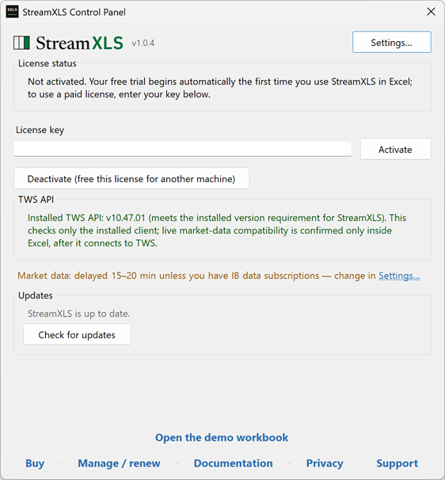

# StreamXLS quickstart

StreamXLS streams real-time Interactive Brokers account, position, order, and market data to Excel using the `RTD` formula.

This page gets you started. [manual.md](manual.md) covers contract specification and order staging in depth; [reference.md](reference.md) lists every topic, field, and status value.

## What StreamXLS does

One function covers every data family — `=RTD("Tws.Rtd",, …)` is the only function you call. Change the arguments and the formula tracks something else: a quote, an account balance, a position, a working order, or an order you stage.

*Fail Loud* — when a value is no longer trustworthy, the cell shows `#N/A` rather than a stale number. Stale data is worse than no data.

Windows desktop Excel only — StreamXLS is a .NET/COM RTD server and Excel is its front end. It does not ship the TWS API; it binds to the copy already installed on your machine.

## Before you start

| You need | Why |
|---|---|
| Windows desktop Excel | StreamXLS is a COM RTD server. Excel on the cloud or a Mac cannot load it. |
| TWS or IB Gateway, running and logged in | StreamXLS connects to it as an API client. |
| API access enabled in TWS | **File → Global Configuration → API → Settings → "Enable ActiveX and Socket Clients"**. |
| TWS API 10.47.01 or newer | The supported floor. StreamXLS uses your installed copy of the API. |

The StreamXLS Control Panel confirms the TWS API version at a glance — its TWS API line turns green
when a supported client is installed. It cannot see the API checkbox inside TWS; confirm that one in
TWS itself:



## Your first formulas

Start with the connection, not with a price. In an empty cell:

```excel
=RTD("Tws.Rtd",, "status", "IsConnected")
```

It returns `1` once StreamXLS has a connection with TWS, `0` otherwise. The first evaluation can take a moment while the handshake completes.

Then ask for a quote:

```excel
=RTD("Tws.Rtd",, "AAPL", "Last")
```

## Fail Loud: what `#N/A` means

**Stale data is worse than no data.** When StreamXLS can't get current data, streaming formulas show `#N/A` instead of the last number seen.

That principle is why quotes are withheld outright on a TWS API too old to receive ticks, why account, PnL, and position cells go `#N/A` when the TWS connection breaks.

You can trade some of it away deliberately — turn on **StreamXLS Control Panel → Settings → Preserve values on disconnect** and last-known values stay visible through an outage, updating when new data returns. Staged-order status is one exception — it is swept regardless of the setting — and market data is another: the setting does not reach it, and each market-data field follows its own rules. The per-family rules are in [Formula states and lifecycle](manual.md#formula-states-and-lifecycle) — read them before using that setting.

## How an RTD formula is built

```excel
=RTD("Tws.Rtd",, {topic strings…})
```

- `"Tws.Rtd"` is the ProgID. Write it in every formula.
- Leave the second argument empty. Excel reserves it as the *Server* argument for its own use — StreamXLS never sees it. ([Why](manual.md#the-server-argument-second-parameter).)
- Everything after that are "topics" — a topic family argument (`status`, `account`, `order`, `orders`, `position`, `positions`, `StageOrder`) followed by that family's arguments. Market data takes no family argument: you name the contract directly.
- Topics and field names are case-*in*sensitive — `"status", "IsConnected"` and `"STATUS", "isconnected"` return the same value.
- One field per cell for `status` and the bare-name metadata fields (`VERSION`, `LICENSE_STATE`, …): these answer for the whole connection or add-in, so beyond a connection reference a formula that names one takes no other argument — extras fail the cell loud.

### Connection specifications

**Talking to more than one TWS instance.** If no connection is specified, StreamXLS will try to connect to the default TWS port. If you have more than one TWS instance, or an instance listening on a non-default port, add a [*connection argument*](manual.md#connection-parameters) to any formula to say which instance you mean.

**Keeping the connection in a cell that is sometimes empty** — the demo workbook's cell `$A$2` "Custom connection" idiom — **works: an empty string simply means "no connection named", so the formula uses the default.** Put that reference at the *end* of the argument list:

```excel
=RTD("Tws.Rtd",, "AAPL", "Last", $A$2)                               ' market quote, connection listed in $A$2
=RTD("Tws.Rtd",, "position", $A$3, "conid="&$A6, "Position", $A$2)   ' position ($A$3 is the optional account filter)
```

Why at the end: `position` and `positions` read the *first* argument after the topic as the `{Accounts}` filter, and a connection reference ahead of it goes wrong either way — a blank one is swallowed as the account filter, pushing your real account into the contract slot; a named one (`paper`, `gw`, `host=…`) is recognized as a connection but does not fill the account slot, so on `position` the contract slides into it and the field into the contract slot. The first case shows an error; the second can parse clean and leave the formula on `#N/A` for a position you never asked for. (`orders` is immune — it strips connection references before reading the account filter — but keeping the reference last means one rule covers every family. [Details](manual.md#connection-parameters).)

Formulas without one use the default, `127.0.0.1:7496` — with one exception. A `status` formula that names no connection piggybacks StreamXLS's sole connection when there is exactly one; with two or more, or with none created yet, it uses the default. The choice is made when the formula is first subscribed. A formula that took the default keeps it; a formula that piggybacked stops answering — `#AMBIGUOUS-CONNECTION` — if a second connection is ever created, rather than go on reporting one connection out of several without saying which. (Ref: [which connection a status cell reads](manual.md#which-connection-a-status-cell-reads).)

## Market data

Market data takes no family argument — name the contract, then the field:

```excel
=RTD("Tws.Rtd",, "AAPL", "MarketPrice")
=RTD("Tws.Rtd",, "AAPL", "Bid")
=RTD("Tws.Rtd",, "AAPL", "Last")
=RTD("Tws.Rtd",, "AAPL", "IsDelayed")
=RTD("Tws.Rtd",, "AAPL@SMART/OPT/20251219/C/180/USD", "MarketPrice")
=RTD("Tws.Rtd",, "ES@CME/FUT/202503/USD", "Last")
```

A bare symbol defaults to `SecType=STK`, `Exchange=SMART`, `Currency=USD`.

Options, futures, forex, combos, and ConID addressing are covered in [contract specification methods](manual.md#contract-specification-methods); the complete field list is in [reference.md §2](reference.md#2-market-data-fields). In the notes below, `{contract}` stands for any of those forms.

Some fields carry specific behavior worth knowing before you rely on them:

- `Last` (strict) `=RTD("Tws.Rtd",, "{contract}", "Last")` — shows `#N/A` when unset under real-time/frozen; shows numeric `Last` once trades arrive.
- `LastOrClose` `=RTD("Tws.Rtd",, "{contract}", "LastOrClose")` — `Last` → `Close` precedence.
- `MarketPrice` `=RTD("Tws.Rtd",, "{contract}", "MarketPrice")` — Mid (`=(Bid+Ask)/2`) → `Last` → `Close` precedence; shows `#N/A` until one of those is available.
- `MarketDataType` `=RTD("Tws.Rtd",, "{contract}", "MarketDataType")` — the actual market-data type TWS is serving for the specific contract, which can vary from the default.
- `IsDelayed` `=RTD("Tws.Rtd",, "{contract}", "IsDelayed")` — returns `1` when TWS is serving this contract delayed data (MarketDataType 3 or 4), `0` when it is serving real-time or frozen real-time data (1 or 2), and `#N/A` before TWS has reported which.

### Market data types

| Type | ID | Behavior |
|---|---|---|
| REALTIME | 1 | Requires API subscription; errors if missing |
| FROZEN | 2 | Last known price when market closed |
| DELAYED | 3 | Auto-fallback: real-time if available, delayed (15-20min) otherwise |
| DELAYED_FROZEN | 4 | Auto-fallback like DELAYED, plus frozen last-session values when the market is closed |

**StreamXLS Control Panel → Settings → Market data** sets the type StreamXLS *requests*.  Out of the box it defaults to type 4. TWS then serves each contract at the best tier your market-data subscriptions allow and reports what it served per contract (accessible with the `MarketDataType`/`IsDelayed` fields above). Under the default (4), one contract can receive real-time data while another is given delayed data — *in the same session, on the same connection*. The tier is a per-symbol fact, so check `IsDelayed` next to each price rather than reading anything into the tier you requested. To refuse delayed data outright, set **Market data** to `Live (real-time)` (type 1): TWS then on returns realtime data, and a contract for which you lack realtime access shows TWS's own explanation, e.g. `RTD error: Requested market data is not subscribed…`, rather than a delayed price. (Set **Settings → Error display** to `NA` if you would rather those read `#N/A`.)

**Delayed prices look live in a plain cell.** A delayed quote is just a number — nothing in the cell marks it as 15-20 minutes old. Two ways to make the delay visible:

1. Indicator fields (recommended): request `IsDelayed` or `MarketDataType` for each contract and display that value nearby (or use that value to drive conditional formatting).
2. In-cell annotation (opt-in): turn on **StreamXLS Control Panel → Settings → Delayed-data annotation** and every delayed-tier numeric value renders as text, e.g. `150.25 (delayed)`.

> Trade-off — read before enabling **Delayed-data annotation**: the value becomes *text*, and Excel treats any text as greater than any number, so comparison formulas on an annotated cell are silently wrong (`=IF(A1>100,...)` is always TRUE; `MAX`/`AVERAGE`/`COUNTIF` skip the cell), while arithmetic fails loud with `#VALUE!`. To recover the number in a formula: `=VALUE(SUBSTITUTE(A1," (delayed)",""))`.

## Account data

Formula: `=RTD("Tws.Rtd",, "account", "{AccountNumber}", "{field}"[, "{currency}"])`.

**The account number is required here** — unlike `position` and `positions`, this topic accepts neither a blank nor `*`, and rejects both with an error rather than defaulting to all accounts.  (You can get a list of your account numbers from `=RTD("Tws.Rtd",, "status", "AccountsCSV")`.)

A full list of account fields provided by the API is in the **Accounts** worksheet of the demo workbook, [StreamXLS.xlsm](../examples/StreamXLS.xlsm), which you can open from the StreamXLS Control Panel.

Examples (using `U1234567` as a placeholder for your account number):

```excel
=RTD("Tws.Rtd",, "account", "U1234567", "NetLiquidation")
=RTD("Tws.Rtd",, "account", "U1234567", "AvailableFunds", "cur=USD")
=RTD("Tws.Rtd",, "account", "U1234567", "OpenPositionCount")
```

- Omit the currency filter and you get the account-level value, not a per-currency one. Per-currency values do not overwrite it.
- Some fields are reported **only** per currency, with no account-wide value.  To receive these you must enable a setting in TWS: **Global Configuration → API → Settings → "Prepend `$LEDGER-` prefix to per-currency account values"**

## Positions list

Which contracts you hold, as one list — not their values. For the details on a specific contract, use [position data](#position-data) below. A position is *active* when its size or its `MarketValue` is non-zero in any covered account.

Formula: `=RTD("Tws.Rtd",, "positions", "{Accounts}", "{field}")` where `field` is `SymbolsCsv` or `ConIdCsv`.

Examples:

```excel
=RTD("Tws.Rtd",, "positions", , "SymbolsCsv")
=RTD("Tws.Rtd",, "positions", "*", "SymbolsCsv")
=RTD("Tws.Rtd",, "positions", "U1234567,U7654321", "SymbolsCsv")
=RTD("Tws.Rtd",, "positions", , "ConIdCsv")
```

- `SymbolsCsv` returns a semicolon-delimited list of unique position identifiers across all accounts by default.
  - For stocks: just the symbol (e.g., `AAPL`)
  - For options: `SYMBOL@EXCH/OPT/Expiry/Right/Strike/Currency` (e.g., `AAPL@SMART/OPT/20251219/C/180/USD`)
  - For futures: `SYMBOL@EXCH/FUT/Expiry/Currency` (e.g., `ES@CME/FUT/202503/USD`)
  - For other contracts: compact slash notation matching the [contract specification methods](manual.md#contract-specification-methods).
- `ConIdCsv` returns a semicolon-delimited list of contract IDs (ConId) for the same active positions.
  - If any active position has no conid yet, the list carries the literal token `Missing ConID` — appended after the numbers, or standing alone if no position has one. It is a marker, not a contract ID: one token covers all such positions, and it will not resolve in a `conid=` lookup.
- `{Accounts}` accepts a comma-separated account filter to restrict to specific accounts; use `*` or leave blank for all accounts.
- To timestamp membership changes, read `=RTD("Tws.Rtd",, "status", "LastPositionListChangeUtc")` alongside the list — it restamps whenever the position set gains or loses a contract, connection-wide.
- In Excel 365, `TEXTSPLIT` spills `SymbolsCsv` to columns or rows:
  - Across columns: `=TEXTSPLIT(RTD("Tws.Rtd",, "positions", , "SymbolsCsv"), ";")`
  - Down rows: `=TEXTSPLIT(RTD("Tws.Rtd",, "positions", , "SymbolsCsv"), , ";")`
  - Guarded until the first list arrives: `=IFERROR(TEXTSPLIT(RTD("Tws.Rtd",, "positions", , "SymbolsCsv"), ";"), "")`

Notes on initial load:

- StreamXLS holds back the first `SymbolsCsv` and `ConIdCsv` until the initial positions snapshot completes (the TWS API `positionEnd` callback) — you get the whole list or nothing, not a partial one. Until then those cells are blank, which is what the `IFERROR` guard above is for. Watch `PositionDataState` to tell waiting from broken: `Requested` or `Receiving` while the snapshot is in flight, `Ready` once it lands.
- After the snapshot, subsequent membership changes publish immediately.

## Position data

Details on your position in a particular contract — size, average cost, market value, and P&L.  For the list of contracts you hold, use [positions list](#positions-list) above.

Formula: `=RTD("Tws.Rtd",, "position", "{Accounts}", "{contract}", "{field}")`

**The account slot aggregates.** A single account number returns that account's position, but blank, `*`, or a comma-separated list rolls every matched account into one number: sizes and P&L sum; average cost is weighted by absolute position size. Contract-metadata fields report the matched contract when the spec resolves to one, and return a loud `Ambiguous position` error naming the matched contract IDs (or `Missing ConID` for a position TWS has not yet identified) when it resolves to more than one.

**Pin the contract when you need exactly one position.** With a blank, `*`, or comma-separated account slot, a partial contract spec rolls up everything it matches, so `"AAPL"` alone can silently combine the stock and its options. With a single named account it does not roll up — it must resolve to exactly one position, so a spec matching several (e.g. `"AAPL"` across the stock and its options) makes the formula return a loud `Ambiguous position` error naming the matched contract IDs (or `Missing ConID` for a position TWS has not yet identified) rather than guessing, until you add `conid=` or enough contract detail that one position matches.

The complete field set with aliases is in [reference.md §8](reference.md#8-position-list-and-option-definition-fields). Common fields:

- `AverageCost` — average cost per share for stocks, per contract for options and futures; size-weighted when the request matches more than one account
- `Position` — position size in shares or contracts; sums across matched accounts
- `MarketValue`
- `DailyPNL`
- `RealizedPNL`
- `UnrealizedPNL`
- Contract metadata fields: `ConID, Symbol, SecType, Strike, Right, Expiry, Exchange, PrimaryExch, LocalSymbol, TradingClass, Currency, Multiplier`

Examples:

```excel
=RTD("Tws.Rtd",, "position", , "AAPL", "Position")
=RTD("Tws.Rtd",, "position", "*", "AAPL@SMART", "MarketValue")
=RTD("Tws.Rtd",, "position", "U1234567,U8901234", "AAPL@SMART/STK", "MarketValue")
```

## Orders list

The `orders` topic returns a comma-separated string of order `permId`s — the permanent order identifiers, not the short per-client Order IDs TWS shows in its own order window. Filter by account, then feed a permId into the [`order`](#order-data) topic to read that order's details.

As with `positions`, `{Accounts}` accepts a comma-separated account filter; use `*`, or leave it blank, for all accounts.

| Formula | Returns |
|---|---|
| `=RTD("Tws.Rtd",, "orders", "{Accounts}", "ListCsv")` | Every order in the TWS book, including filled and cancelled. |
| `=RTD("Tws.Rtd",, "orders", "{Accounts}", "OpenListCsv")` | Working orders only — `Filled`, `Cancelled` and `ApiCancelled` are excluded as completed, and `Inactive` is excluded as not working (StreamXLS does not treat it as final: TWS can move it back to working). |

**Mind the delimiter** — the `orders` lists are comma-separated, while the `positions` lists above are semicolon-separated. In Excel 365:

- Across columns: `=TEXTSPLIT(RTD("Tws.Rtd",, "orders", , "OpenListCsv"), ",")`
- Down rows: `=TEXTSPLIT(RTD("Tws.Rtd",, "orders", , "OpenListCsv"), , ",")`
- Guarded until the first list arrives: `=IFERROR(TEXTSPLIT(RTD("Tws.Rtd",, "orders", , "OpenListCsv"), ","), "")`

## Order data

```excel
=RTD("Tws.Rtd",, "order", "{permId}", "{field}")
```

`{permId}` is the TWS permanent order ID — take it from the orders-list topics (`ListCsv`/`OpenListCsv`), which return permIds, not the small per-client Order IDs TWS shows in its own order window.

Examples, assuming an order exists with `permId=265598123`:

```excel
=RTD("Tws.Rtd",, "order", "265598123", "STATUS")
=RTD("Tws.Rtd",, "order", "265598123", "SYMBOL")
=RTD("Tws.Rtd",, "order", "265598123", "FILLED")
```

Common fields (the complete list is in [reference.md §5](reference.md#5-order-read-fields)):

- `STATUS` — current order status (see [Order status values](#order-status-values) below)
- `SYMBOL`, `CONID`, `SECTYPE`, `EXCHANGE`, `CURRENCY`
- `ACTION` (`SIDE`), `ORDERTYPE` (`TYPE`), `QUANTITY` (`TOTALQUANTITY`)
- `LMTPRICE` (`LIMITPRICE`), `AUXPRICE` (`STOPPRICE`), `AVGFILLPRICE`
- `FILLED`, `REMAINING`
- `TIF` (`TIMEINFORCE`), `GOODTILLDATE`, `GOODAFTERTIME`
- `ACCOUNT`, `PERMID`, `PARENTID`, `FIRSTSEENUTC`, `LASTUPDATEUTC`

### Order status values

An `order` topic `STATUS` cell reports the status strings in TWS's own spelling — `ApiPending`, `PendingSubmit`, `PendingCancel`, `PreSubmitted`, `Submitted`, `Filled`, `Inactive`, and the cancel strings `Cancelled`/`ApiCancelled` with two L's, exactly as TWS spells them. A staged-order cell (`StageOrder`) reports the same spellings, with one collapse: it shows a terminal `ApiCancelled` as `Cancelled`, so a staged cell carries a single cancel word. The complete status vocabulary with active/terminal classification is in [reference.md §7](reference.md#7-order-status-vocabulary); the staging lifecycle is in [Formula states and lifecycle](manual.md#formula-states-and-lifecycle).

## Staging orders

**StreamXLS stages order tickets; it does not transmit orders to the market.** A `StageOrder` formula builds the order and hands it to TWS, where it waits for you to submit it. StreamXLS has no path that can place an order; the human click is a design choice, not a missing feature.

```excel
=RTD("Tws.Rtd",, "StageOrder", "sym=AAPL", "side=BUY", "shares=100", "type=LMT", "limit=150.05", "exch=SMART")
```

Staging is a side effect of subscribing — entering the formula stages the order, and each cell holding the formula stages its own.

Arguments are `key=value` pairs in any order, written one per argument or semicolon-joined into a single argument (`"sym=AAPL;side=BUY;shares=100;type=LMT;limit=150.05"`) — except `algoparams`, `tag` (and its synonyms), `account`, `fagroup`, `ocagroup` and any connection argument, each of which must be its own argument. `sym`, `side`, `shares`, and `type` are required. Order types that need a price require it: `type=LMT` needs `limit`, `type=STP` needs `stop`, `type=TRAIL` needs exactly one of `stop` or `trailingpercent`. `exch` defaults to `SMART`.

Non-stock contracts use the same contract keys as everywhere else — add `sec=`, `exp=`, `strike=`, `right=`, `conid=`, and the rest to stage an option, future, or FX order; security type defaults to `STK` and currency to `USD` when omitted. Multi-leg combos (`sec=BAG`) are not supported.

The formula reports the order status back to you — `Sending` while the ticket is in flight, `Staged` once TWS has accepted it without error, then TWS's own status strings as the order progresses there.

By default the order arrives in TWS deactivated, visible to your other TWS instances, surviving a TWS restart, with a **Submit** button that sends it to market in one click. Add `park=true` to stage it instead as a local order-entry ticket with a **Transmit** button, visible only in your own TWS. Either way the order cannot reach the market without your action in TWS.

Staging happens once, when you enter the formula. Reopening a saved workbook does not re-stage: StreamXLS recognizes the reopen and the cell reads `Disarmed: workbook reopen does not re-stage orders…` instead. Re-enter the formula (F2, Enter) to stage again deliberately. TWS reconnects do not re-stage either.

> Editing a staged order's parameters stages a second order — it does not modify the first. Modifying or deleting staged order tickets must be done in TWS.

The complete key set with aliases and value grammars is in [reference.md §4](reference.md#4-stageorder-write-keys); the full lifecycle is in [Staging orders](manual.md#staging-orders-stageorder).

## Option chains

Point a bare contract at three option-definition fields and StreamXLS enumerates its listed chain, so a strike ladder or expiry list comes from TWS instead of a hard-coded range.

```excel
=RTD("Tws.Rtd",, "SPY", "OptionExpirationsCSV")
=RTD("Tws.Rtd",, "SPY", "OptionStrikesCSV")
=RTD("Tws.Rtd",, "SPY", "StrikeStep")
```

- `OptionExpirationsCSV` — comma-separated expiration dates with listed options on the underlying.
- `OptionStrikesCSV` — comma-separated strikes with listed options on the underlying.
- `StrikeStep` — the smallest strike increment reported in that chain, as a number.

All three resolve the underlying and query TWS for its chain, so they show `#N/A` until TWS answers and stay `#N/A` if it reports nothing. `StrikeStep` also stays `#N/A` when fewer than two strikes come back — there is no increment to measure.

In Excel 365, `TEXTSPLIT` spills either list:

- Across columns: `=TEXTSPLIT(RTD("Tws.Rtd",, "SPY", "OptionStrikesCSV"), ",")`
- Down rows: `=TEXTSPLIT(RTD("Tws.Rtd",, "SPY", "OptionStrikesCSV"), , ",")`
- Guarded until the first list arrives: `=IFERROR(TEXTSPLIT(RTD("Tws.Rtd",, "SPY", "OptionStrikesCSV"), ","), "")`

Field definitions are in [reference.md §8](reference.md#8-position-list-and-option-definition-fields); for naming the underlying precisely see [contract specification methods](manual.md#contract-specification-methods).

## Connection status

`=RTD("Tws.Rtd",, "status", "{field}")` reports what StreamXLS knows about one connection to TWS — which one depends on the connection argument, and on the workbook, per [Which connection a status cell reads](manual.md#which-connection-a-status-cell-reads). With a single TWS you can leave the connection argument off. In a workbook that ever reaches two connections, name the connection in every status formula: an argument-less cell that had piggybacked the first one reports `#AMBIGUOUS-CONNECTION` instead of answering for a connection you never chose.

```excel
=RTD("Tws.Rtd",, "status", "IsConnected")
=RTD("Tws.Rtd",, "status", "ConfigWarnings")
```

| Field | What it reports |
|---|---|
| `IsConnected` | `1` while StreamXLS holds a TWS connection, `0` otherwise. |
| `ConnectionKey` | Which TWS this formula is actually reading, as `host:port:clientId`. |
| `ActiveTopicCount` | How many distinct subscriptions are open. |
| `AccountsCSV` | Comma-separated managed account numbers. |
| `ConfigWarnings` | Configuration-validation warnings, joined with ` \| `; empty when the configuration is clean. |
| `LastUpdateUtc` | UTC time of the last successful data update published by the server. |
| `ServerHeartbeatUtc` | UTC time of the server's most recent status pass. |
| `ServerVersion` | This connection's negotiated TWS `ServerVersion`, or `Not Connected` before one is negotiated. |
| `MarketDataType` | The market-data tier StreamXLS *requests* — not what TWS served a given contract. |
| `MarketDataState` | `Ok` / `TooOld` / `Unknown`. |
| `MarketDataMessage` | The actionable "update your TWS API" detail when `MarketDataState` is `TooOld`; empty otherwise. |
| `OrderDataState` | Where the order feed is in its load cycle. |
| `LastOrderListChangeUtc` | UTC time an `orders` list last gained or retired a member. |
| `LastOrderUpdateUtc` | UTC time TWS last reported a change to any order data. |
| `LastOrderPollUtc` | UTC time the last complete open-orders response arrived. |
| `PositionDataState` | Where the position feed is in its load cycle. |
| `LastPositionListChangeUtc` | UTC time the set of open symbols last changed. |
| `LastPositionUpdateUtc` | UTC time of the last position callback, membership change or not. |
| `RotationCount` | How many times this connection has automatically rotated its client ID. |
| `UPDATE_AVAILABLE` | `1` when a newer StreamXLS release is available, `0` when a check has run and found none, `#N/A` when no completed check is on record. |
| `UPDATE_CRITICAL` | `1` when that update is marked critical, `0` when it is not, `#N/A` on the same terms. |
| `UPDATE_LATEST_VERSION` | The latest available version. |
| `UPDATE_MESSAGE` | Update guidance text — including why the status is unknown, when it is. |

Notes on individual fields:

- `LastUpdateUtc` and `ServerHeartbeatUtc` are Excel date-time values in UTC, not text — an unformatted cell shows the underlying serial number, so format the cell as a date/time. Compare them with date arithmetic, not text functions, and mind the zone: `NOW()` is your local clock.
- `IsConnected` refers to the connection between StreamXLS and TWS, not between Excel and StreamXLS.
- `ServerHeartbeatUtc` advances on every status pass the server runs. Excel's heartbeat usually drives that pass, and Excel owns its cadence, which can vary with Excel's activity; connection events stamp it too, and if you disable the Excel heartbeat or raise it above Excel's floor the engine runs its own cadence instead. What it never tracks is TWS: it advances whether or not TWS is answering.
- `ConnectionKey` reports the connection this formula bound to, as `host:port:clientId`. Read it rather than infer it — a status formula naming no connection binds to one you never named, and it stays there (if it had piggybacked the only connection and a second one appears, the cell reports `#AMBIGUOUS-CONNECTION` instead of quietly answering for one of them). It is a report, not a connection argument: an automatically assigned client ID is not part of the connection's identity, so pasting the value back into a formula names a different connection.
- `MarketDataType` is the tier StreamXLS *requests* via `TWS_RTD_MARKET_DATA_TYPE` (default 4): 1=REALTIME, 2=FROZEN, 3=DELAYED, 4=DELAYED_FROZEN. TWS serves each contract at the best tier your subscriptions allow, so check the per-contract `MarketDataType` or `IsDelayed` field to see what a given symbol is getting. See [Market data](#market-data).
- `AccountsCSV` is populated from the TWS `managedAccounts` callback during the connection handshake (e.g. `DU123456,DU789012`). In Excel 365, `TEXTSPLIT` spills it:
  - Across columns: `=TEXTSPLIT(RTD("Tws.Rtd",, "status", "AccountsCSV"), ",")`
  - Down rows: `=TEXTSPLIT(RTD("Tws.Rtd",, "status", "AccountsCSV"), , ",")`
- `ServerVersion`, `MarketDataState`, and `MarketDataMessage` are per-connection diagnostics — each TWS connection negotiates its own protocol level, so if connecting to multiple TWS or IB Gateway instances from the same workbook, supply a [connection argument](manual.md#connection-parameters) (e.g. `paper`, `gw`, or `host=`/`port=`) to confirm which one you want the status for; with a single connection, omit it and the status piggybacks that connection — but only while StreamXLS has exactly one connection, after which such a cell reports `#AMBIGUOUS-CONNECTION` instead of diagnosing one connection out of several. `MarketDataState` is `Ok` when the negotiated protocol can stream market data (`ServerVersion` >= 206), `TooOld` when it cannot (1–205), `Unknown` before a version is negotiated.
- `ConfigWarnings` and the four `UPDATE_*` fields re-resolve on every heartbeat, so a subscribed cell picks up a mid-session change without re-entering the formula. The update fields only read a local file and do not calls over the network.

### Data-state and freshness topics

The order and position subsystems each publish a state field and two timestamps, so you can tell a *data* update apart from a *membership* change. The state fields and the list-change stamps behave identically; **the two update stamps deliberately do not** — see the note under the table.

| Positions | Orders | What it tells you |
|---|---|---|
| `PositionDataState` | `OrderDataState` | Where the subsystem is in its data cycle. |
| `LastPositionListChangeUtc` | `LastOrderListChangeUtc` | Membership changed — a symbol entered or left the position set; an order appeared, disappeared, or crossed into or out of the working set. |
| `LastPositionUpdateUtc` | `LastOrderUpdateUtc` | TWS delivered data — but on different terms. See below. |

`PositionDataState` can return all five values below. `OrderDataState` never reports `Idle` — before the
first order formula is subscribed it reads `Disconnected`, even while the connection is up.

| Value | Meaning |
|---|---|
| `Disconnected` | Not connected to TWS. |
| `Idle` | Positions only: no position subscription is active. |
| `Requested` | Subscription sent to TWS; waiting for the first callback. |
| `Receiving` | Callbacks arriving; the initial snapshot is still in progress. |
| `Ready` | Initial snapshot complete, all data available and presumed current. |

**The two update stamps are not symmetric, on purpose:**

- `LastOrderUpdateUtc` is a **change** stamp. It advances whenever TWS reports order information that changes a value StreamXLS can put in a cell — a new order, a status or fill move, an order dropping out of the open-order snapshot, and any modification to an order field you can subscribe to (price, quantity, time in force, account, the order flags, and the rest). Read it as "order news arrived, re-read" rather than "this exact cell differs": nothing you could see in a cell is missed, and the stamp does occasionally move for news that ends up displaying the same way. StreamXLS re-polls open orders every 15 seconds by default, and a poll that re-delivers the same orders unchanged leaves this cell alone.
- `LastPositionUpdateUtc` is a **freshness** stamp. It advances on every position callback StreamXLS accepts, whether the numbers moved or not. TWS pushes positions rather than answering a poll, so an unchanged re-delivery is itself evidence the feed is alive.

Because `LastOrderUpdateUtc` is change-gated, it cannot tell a quiet market from a stopped feed — both look like a cell that is not moving. `LastOrderPollUtc` answers that question instead: it advances on every completed open-orders round trip, so while the order feed is healthy it keeps moving on the poll interval, and it freezes if TWS stops answering. A staleness alarm on the *feed* belongs on `LastOrderPollUtc`; an alarm on your *orders* belongs on `LastOrderUpdateUtc`.

> `ServerHeartbeatUtc` is not a substitute. It measures StreamXLS running, not TWS answering, so it keeps ticking even when TWS is stuck.

To detect a membership change, watch the list-change stamp and re-read the list — pair `LastPositionListChangeUtc` with `SymbolsCsv` or `ConIdCsv`, and `LastOrderListChangeUtc` with `ListCsv` or `OpenListCsv`. `LastOrderListChangeUtc` advances when the rendered list actually changes, so it will not wake you for an unchanged poll — but note it is connection-wide (see below), so it can also move for orders outside the accounts your formulas display. On the position side the update stamp advances on every callback, so it cannot tell you membership held still.

**The order timestamps are connection-wide, not account-scoped** — they are not scoped to the accounts your `ListCsv`/`OpenListCsv` formulas subscribe to. An order that appears for an account you are not displaying still bumps both `LastOrderListChangeUtc` and `LastOrderUpdateUtc`, because StreamXLS tracks every order TWS reports on the connection. An account filter narrows the rendered list, not the timestamps.

Market data has its own state field, `MarketDataState`, documented above.

## Build, license, and TWS API information

A short list of fields is addressed by bare name — three arguments, no family argument. These are the first things to check when something is not working, and the first things support will ask for.

```excel
=RTD("Tws.Rtd",, "VERSION")
=RTD("Tws.Rtd",, "LICENSE_STATE")
=RTD("Tws.Rtd",, "TWSAPI_VERSION")
```

| Fields | Report |
|---|---|
| `VERSION`, `BUILD_TIME`, `SERVER_PATH`, `CONFIGURATION`, `ASSEMBLY_NAME` | Which StreamXLS build is loaded, and from where. |
| `LICENSE_STATE`, `LICENSE_MESSAGE`, `LICENSE_DAYS_REMAINING` | Entitlement state, and days left while on trial — `#N/A` if a trial is running but its end date could not be read, never a guessed number. |
| `TWSAPI_STATE`, `TWSAPI_MESSAGE`, `TWSAPI_VERSION` | Which TWS API copy StreamXLS resolved, and actionable guidance when it could not. |
| `UPDATE_AVAILABLE`, `UPDATE_CRITICAL`, `UPDATE_LATEST_VERSION`, `UPDATE_MESSAGE` | Whether a newer release is out — `#N/A` on the flags if no completed update check is on record for this computer, never a guessed "you are current". |

`TWSAPI_VERSION` is the field to read when quotes are missing but orders and positions work — it reports the version of the TWS API actually in use, which is what the version floor is measured against. It is empty when no version could be detected; `TWSAPI_MESSAGE` says why.

Full list: [reference.md §9](reference.md#9-status-and-metadata-fields).

## Troubleshooting

Start here when a cell does not show what you expect. The deeper per-family rules are in [Formula states and lifecycle](manual.md#formula-states-and-lifecycle).

| What you see | What it means | What to do |
|---|---|---|
| `#N/A` everywhere, including `status` cells | Excel has not loaded StreamXLS | Restart Excel — a newly installed build only loads on restart. |
| `IsConnected` = 0 | The server is running but TWS is not reachable | Confirm TWS or IB Gateway is logged in, has its API socket enabled, and that the port matches what you list in the connection fields of your RTD formulas. |
| `#N/A` in a data cell while `IsConnected` = 1 | No value has arrived yet, or none is available | Ensure you can access the requested value in TWS. |
| Orders and positions update, quotes do not | The TWS API is too old to carry market data | Check `MarketDataState` and `MarketDataMessage`, then update the TWS API to 10.47.01 or newer. |
| `#LEDGER-DISABLED …` in a per-currency account cell | Per-currency account values need a TWS setting | Enable **Global Configuration → API → Settings → "Prepend `$LEDGER-` prefix to per-currency account values"**, then reconnect. |
| `#AMBIGUOUS-CONNECTION …` in a `status` cell | The formula names no connection, it had piggybacked the only one, and a second connection now exists | Add a connection argument (`paper`, `gw`, `host=`, `port=`) so the cell names the TWS you mean. See [which connection a status cell reads](manual.md#which-connection-a-status-cell-reads). |
| `RTD error: Unknown order field 'FOO'` | A misspelled order field | Check the spelling against fields listed in [reference.md §5](reference.md#5-order-read-fields). |
| `#VALUE!` in arithmetic on a price | Delayed-data annotation is on, so the cell holds text | Strip it with `=VALUE(SUBSTITUTE(A1," (delayed)",""))`, or turn annotation off. |
| `Disarmed: workbook reopen does not re-stage orders…` | A saved `StageOrder` formula — reopening a workbook does not re-stage | Re-enter the formula (F2, Enter) to stage deliberately. See [Staging orders](#staging-orders). |
| A number that never moves | Excel is in Manual Calculation mode | Set Calculation back to Automatic, or press F9. |

## FAQ

These are the questions that come up while you are building your first sheet. For product questions — licensing, supported Windows/Excel/TWS versions, updates, and support — see the [full FAQ](FAQ.md).

### What happens if TWS closes while I have active RTD requests?

- The connection to TWS drops and account, position, and PnL values stop updating. Time-sensitive values switch to `#N/A` rather than hold a number that could be stale.
- Prefer to keep the last values on screen through an outage? Turn on **StreamXLS Control Panel → Settings → Preserve values on disconnect**. A cell that had a value keeps it while no TWS connection is available, and updates it when data returns; a cell that never had one stays `#N/A`. What each family does:

  | Cell family | Default (`false`) | With the setting on |
  |---|---|---|
  | `account`, PnL | `#N/A` for the outage | Last value held, updated on reconnect |
  | `position` | `#N/A` for the outage | Last value held — except a position the completed reconnect snapshot no longer reports, which stays `#N/A` |
  | `order`, orders lists | Working orders `#N/A`; completed facts (`Filled`, `Cancelled`/`ApiCancelled`) preserved. `Inactive` sweeps too — TWS can move an inactive order back to working, so it is not a completed fact. Open-order lists go `#N/A`; all-orders lists stay | Last displayed values held until reconnect updates them |
  | `StageOrder` | Non-terminal staged status `#N/A`, `Inactive` included; `Filled` and `Cancelled` preserved | Identical — this family ignores the setting |
  | Market data | Per-field rules | Per-field rules — the setting does not reach market data |

  Staged orders are swept unconditionally because once you submit a staged order in TWS, IBKR can fill or cancel it while the connection is down, so a stale `Submitted` must not sit on screen. The exact per-family behavior is in [Formula states and lifecycle](manual.md#formula-states-and-lifecycle).
- You can monitor connection state via status topics:
  - `=RTD("Tws.Rtd",, "status", "IsConnected")` → `1` when connected, `0` otherwise
  - `=RTD("Tws.Rtd",, "status", "LastUpdateUtc")` → an Excel date-time value (UTC) marking the last successful update published by the server; empty until the first update arrives
  - `=RTD("Tws.Rtd",, "status", "ActiveTopicCount")` → how many distinct subscriptions the server holds (formulas that resolve to the same subscription count once); this reports what you have asked for, not whether data is arriving
- Exactly what each cell family shows on disconnect, reconnect, or a license/trial lapse is documented in [Formula states and lifecycle](manual.md#formula-states-and-lifecycle).

### I want to open a saved workbook and see the last values, without connecting to TWS. How?

- Put Excel into Manual Calculation mode (**Formulas → Calculation Options → Manual**) *before* opening the workbook. Excel then does not re-evaluate the RTD formulas on open. This is an Excel setting, not a StreamXLS one — it needs no TWS connection and changes nothing in the engine.
- Switch back to Automatic calculation when you want live data again.

### My orders and positions update, but I get no market-data quotes. Why?

- Almost certainly your TWS API is too old.  Diagnose with the per-connection status fields:
  - `=RTD("Tws.Rtd",, "status", "MarketDataState")` → `Ok` / `TooOld` / `Unknown`
  - `=RTD("Tws.Rtd",, "status", "MarketDataMessage")` → the actionable detail when `TooOld`
  - `=RTD("Tws.Rtd",, "status", "ServerVersion")` → this connection's negotiated `ServerVersion`
- Fix: install TWS API version 10.47.01 or newer and reconnect.

### What happens if I restart TWS?

- StreamXLS notices the dropped connection and sets `IsConnected` to 0. A clean TWS shutdown is seen at once; a connection that dies silently is caught by the connection watchdog instead, so `IsConnected` can lag the drop. What your cells show meanwhile follows the disconnect rules above.
- Recovery does not need you — StreamXLS reconnects and re-subscribes your topics once TWS is accepting connections again.

### How do I reconnect to TWS?

- If you open Excel before TWS, or leave it open while TWS restarts, StreamXLS reconnects on its own and re-subscribes the topics you requested.
- When Excel is busy, that reconnection can take a minute or longer.
- To force it, close and reopen Excel, or run `Application.RTD.RefreshData` in the VBA Immediate window (Alt+F11 to open the editor, then Ctrl+G).

**Reconnecting does not re-stage orders.** A `StageOrder` cell stages when the formula is freshly entered, so an automatic reconnect leaves your staged orders alone — it re-subscribes data topics only. See [Staging orders](#staging-orders).

### Can I run more than one Excel instance?

- Yes. Each Excel process hosts its own StreamXLS instance, with its own TWS connection, its own subscriptions, and its own automatically allocated API client ID, so two workbooks in two Excel processes do not compete for one connection.
- **Subscriptions are shared within a process, not across processes** — the same symbol is subscribed once per Excel process.
- There is no shared-connection mode: if you want a single connection to TWS, keep your work in one Excel process.

### What if the engine stops?

- Excel keeps the last values it received, then updates when a new instance comes up. So long as the workbook still holds `=RTD()` formulas, Excel re-instantiates the server on its next heartbeat and StreamXLS re-subscribes your data topics; a cell that had no value yet stays `#N/A`.
- `StageOrder` cells are not re-armed by that recovery — a re-subscription is not a user action, so nothing is staged and the cell reads `Disarmed: …`. Track anything already working with the `orders`/`order` topics, or re-enter the formula (F2, Enter) to stage again deliberately.

### How can I determine the last time of a successful RTD update?

- Use the status topic `LastUpdateUtc`:
  - `=RTD("Tws.Rtd",, "status", "LastUpdateUtc")`

### How can I detect stale subscriptions?

- Combine `IsConnected` and `LastUpdateUtc`. With `IsConnected` in `A1`, `LastUpdateUtc` in `A2`, and your hours-to-UTC offset in `B1`, this flags a feed that has gone quiet while the connection still claims to be up:

```excel
=IF(AND(A1=1, (NOW()+B1/24-A2)*86400 > 30), "STALE", "OK")
```

- `LastUpdateUtc` is UTC; `NOW()` is your local clock; `B1` holds the hours to add to local time to reach UTC. Omit it and the comparison is off by hours: west of UTC (all US time zones) the cell sits on `OK` no matter how stale the feed is; east of UTC it sticks on `STALE`.
- Pick the threshold to suit the instrument — 30 seconds is reasonable for an actively traded name during market hours, and far too tight for an illiquid one.
- `NOW()` advances only when Excel recalculates — in a workbook whose other cells are still streaming that happens on its own, but in a quiet one press F9 before trusting an `OK`.

### How do I change how often Excel pulls updates?

Excel controls the pull interval, not StreamXLS. Excel calls the server's `RefreshData()` on its own cadence. `Application.RTD.ThrottleInterval` can throttle the refresh rate but not increase it. Set it from the VBA Immediate window:

```vba
Application.RTD.ThrottleInterval = 250  ' Maximum RTD refresh rate in milliseconds
```

This limits Excel's refresh rate; it does not force it.  Regardless of any setting, ultimately Excel decides when it has time to collect RTD updates.

## Where to go next

- [manual.md](manual.md) — contract specification for options, futures, forex and combos; the full order-staging lifecycle; what every cell family shows through disconnects and reconnects.
- [Advanced: environment variables](manual.md#advanced-environment-variables) — every StreamXLS Control Panel setting, its environment-variable form and default, and the rules that decide which one wins.
- [reference.md](reference.md) — every topic, field, alias, configuration key, and error string.
- The demo workbook — every feature already wired up. Open it from the **StreamXLS Control Panel → Open the demo workbook**.
- Questions — [support@streamxls.com](mailto:support@streamxls.com).

---

*StreamXLS is not affiliated with, endorsed by, or sponsored by Interactive Brokers or Microsoft. It does not redistribute the TWS API — it binds to the copy already installed on your machine.*
